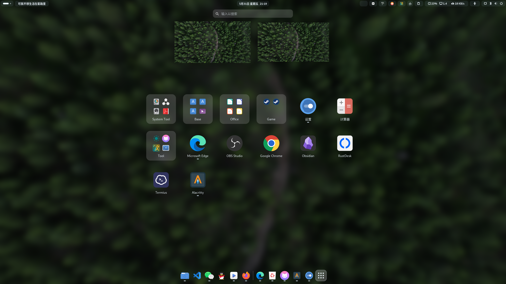
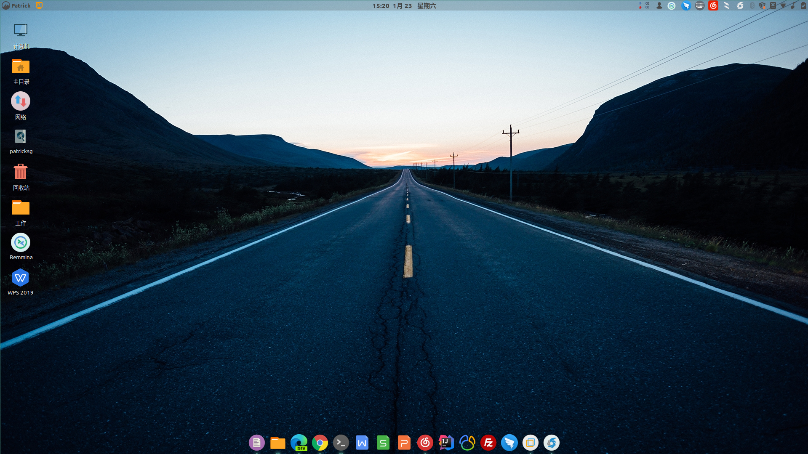
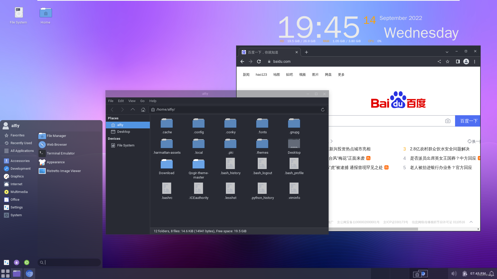

# 桌面环境

Linux 桌面环境是指 Linux 系统中提供图形用户界面的软件。它允许用户通过图形化的方式与计算机进行交互，而不是仅仅使用命令行。

在早期的计算机系统中，图形用户界面并不常见，用户通常需要通过命令行与计算机进行交互。自 20 世纪 90 年代以来，Linux 桌面已经从简单的窗口管理器成熟为完整的桌面了。Linux 社区中的许多开发人员和组织都在努力创造一个更好的图形用户界面，以满足用户的需求。

例如，KDE 和 GNOME 都是由 Linux 社区中的开发人员创建的，它们旨在为用户提供一个易于使用且集成的桌面环境。

> [!IMPORTANT]
> 对于服务器来说，通常不安装桌面环境，因为它们通常通过命令行远程管理。桌面环境会占用额外的系统资源，而这些资源对于服务器来说更重要的是用于运行服务和应用程序。此外，桌面环境可能会带来额外的安全风险，因此在服务器上不安装桌面环境也有助于提高安全性。

## KDE

KDE 是一个国际性的自由软件社区，它开发了许多流行的应用程序和桌面环境。KDE 社区的目标是开发基本的桌面功能和日常必需的应用程序，以及提供开发者编写独立的应用程序的工具和文档。

KDE 最初指的是 K Desktop Environment，即 K 桌面环境。但随着时间的推移，KDE 社区不仅开发了桌面环境，还开发了许多其他应用程序和工具。因此，KDE 现在指的是开发这些软件的社区，而他们开发的桌面环境被称为 Plasma 桌面。有些人仍然习惯将 Plasma 桌面称为 KDE，这是一种遗留习惯。

许多独立应用程序和规模较小的项目是基于 KDE 的技术，KDE 项目组还还发了大量的可运行在 KDE 环境中的应用程序，包括 Dolphin（文件管理工具）、Konsole（终端）、Kate（文本编辑工具）、Gwenview（图片查看工具）、Okular（文档及 PDF 查看工具）、Digikam（照片编辑和整理工具）、KMail（电子邮件客户软件）、K3b（DVD 刻录程序）、Dragon Player（视频播放器）等，它们都是默认安装的。

它最著名的产品是 Plasma 桌面，是许多 Linux 发行版的默认桌面环境，例如 openSUSE、Mageia、Linux Mint（19 版开始不再支持）、Kubuntu、PCLinuxOS 与 Chakra GNU/Linux。

> [!TIP] 原图地址（美化教程）
> <https://hujiekang.top/posts/kde-customization/>

## GNOME

GNOME 是一个流行的 Linux 桌面环境，它以简洁、易用和优秀的组织能力而闻名。GNOME 项目最初是作为专有桌面（包括 KDE）的自由开源替代品而创建的，此后一直在不断发展壮大。GNOME 采用了由 GIMP 项目开发的 GTK+，并将其开发为强大的通用 GTK 框架。该项目挑战了桌面「应有」的外观，并为用户提供了新的范例和选项。

除了桌面环境本身，GNOME 社区还开发了许多优秀的应用程序，包括文本编辑器 Gedit、PDF 查看器 Evince、Web 浏览器、图片查看器、Nautilus 文件管理器、GNOME 终端等。这些应用程序都与 GNOME 桌面环境紧密集成，为用户提供了一站式的解决方案。

在大多数主流现代 Linux 发行版（包括 RHEL、Fedora、Debian 和 Ubuntu）中，GNOME 都作为默认桌面而广泛使用。它提供了一个简洁、直观且高度可定制的用户界面。用户可以通过更改主题、颜色、字体和窗口装饰等来定制桌面的外观。

2011 年，GNOME 3 进行了重大更新，不再采用传统的 Windows 风格的界面，而是进行了全新的设计，惊艳了很多用户。GNOME 3 的这种行为也导致部分用户和开发人员不满，他们认为 GNOME 3 的界面过于复杂，不如传统的 GNOME 2 界面直观易用。因此，他们开发了多款其他的桌面环境，比如 MATE 和 Cinnamon，这些桌面环境旨在提供传统的 GNOME 桌面体验。

> [!TIP] 原图地址（美化教程）
> <https://panp.cc/posts/gnome-style/>

## Cinnamon

Cinnamon 是类 Unix 系统下的一个桌面环境。最初是 GNOME Shell 的一个派生版本，由 Linux Mint 开发，提供了相似于 GNOME 2，易于使用的传统用户界面，从 Cinnamon 2.0 开始，成为独立的桌面环境。

Cinnamon 桌面环境提供了许多高级功能和高度的可定制性。用户可以通过设置管理器来定制桌面的外观和行为，无需安装任何外部插件或调整工具。Cinnamon 甚至允许用户直接从设置管理器下载并安装主题，无需打开互联网浏览器。这些功能使得 Cinnamon 成为一个易于使用且功能强大的桌面环境。

Cinnamon 是 Linux Mint 发行版的默认桌面环境，除此之外 Cinnamon 桌面环境在许多流行的 Linux 发行版中都有各自的版本，包括 Ubuntu、Fedora、OpenSUSE、Gentoo 和 Arch Linux 等。

> [!TIP] 原图地址（美化教程）
> <https://www.cnblogs.com/patricksg/p/14289477.html>

## Xfce

Xfce 是一个轻量级的桌面环境，它适用于多种类 UNIX 操作系统。Xfce 致力于快速运行且占用系统资源少，同时仍然具有视觉吸引力且易于使用。

Xfce 使用 Xfwm 作为默认的视窗管理器，亦可搭配 Openbox 等其他视窗管理器协作。Xfce 由许多彼此独立的组件所构成，除了本身，还有第三方的程序使用 Xfce 的程序库，如文本编辑器 Mousepad、多媒体播放程序 Parole 与终端模拟器。

由于 Xfce 占用的系统资源非常少，它适合在低端硬件计算机上使用。

> [!TIP] 原图地址（美化教程）
> <https://blog.csdn.net/alfiy/article/details/126859106>
