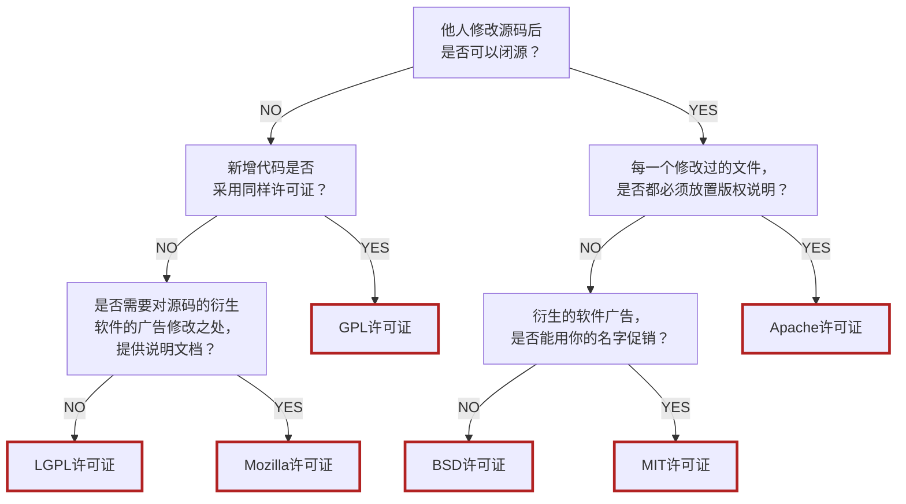

# 开源软件

开源软件，英文表示是 open source software，简称为 OSS，直接的字面意思是公开源代码的软件。软件既然连源代码都公开，因此开源软件具备可以免费使用和公布源代码的主要特征。

Linux 正是一个开源的软件，它的源代码可以被任何人查看、修改和分发。它的开源性质使得它能够在全球范围内得到广泛的应用和发展。Linux 本身就是开源精神的受益者，它几乎是全球最大的开源软件之一。学习 Linux，不得不谈到开源精神。

开源软件通常会遵守特定的许可证，这些许可证规定了发布者和用户之间的权利和义务。与闭源软件不同，开源软件通常具有良好的透明度、可靠性和安全性，因为任何人都可以审查和发现潜在的安全漏洞或错误。另外，开源软件社区具有活跃的通信和协作文化，有助于加强软件的稳定性和功能性。

## 开放源代码运动

开放源代码运动（Open Source Movement）是一个旨在促进和支持开源软件发展的运动。它的目标是通过提供免费、高质量的软件，来促进技术创新和社会进步。

开放源代码运动起源于 20 世纪 90 年代，当时一群程序员开始分享和协作开发软件。他们认为，通过公开源代码，可以促进软件的发展和改进。这一理念逐渐获得了广泛的支持，并在全球范围内推广开来。

如今，开放源代码运动已经成为全球性的运动，拥有数百万支持者和贡献者。它提供了许多优秀的开源软件，包括操作系统、办公套件、图形编辑器和编程工具等。这些软件提供了巨大的便利，并推动了技术创新和社会进步。

许多人将开放源代码与自由软件（Free Software）视为相同，但若以定义条件而言，自由软件仅是开放源代码的一种，也就是自由软件的定义较开放源代码更为严格，并非开放源代码的软件就可称为自由软件，要视该软件的许可条件是否合乎自由软件基金会对自由软件所下的定义：

- 自由软件是在电脑为个人或为公共利益，而非私人公司或政府等企图限制或监控工作时，家、学校、公司使用时，具有其控制权。

开放源代码有时不单指开放源代码软件，它同时也是一种软件开放模式的名称。使用开放源代码开放模式的软件代表就有 Linux 操作系统。

严格地说来，开放源代码软件与自由软件是两个不同的概念，只要符合开源软件定义的软件就能称为开放源代码软件（开源软件）。自由软件是一个比开源软件更严格的概念，因此所有自由软件都是开放源代码的，但不是所有的开源软件都能称为「自由」。但在现实上，绝大多数开源软件也都符合自由软件的定义。比如，遵守 GPL 和 BSD 许可的软件都是开放的并且是自由的。

「开放源代码软件运动」是一个主要由程序工程师及其它电脑用户参与的声势浩大的运动。它是自由软件运动的一个分支，但两者的差别并不明显。一般而言，自由软件运动是基于政治及哲学思想（有时称为所谓黑客文化）的理想主义运动，而开放源代码运动则主要注重程序本身的质量提升。

## 开源软件特征

开源软件是指源代码公开且可自由使用、修改和分发的软件，它具有以下特征：

- **开源协议**：开源软件采用开源协议，这使得使用者可以在遵守协议规定的前提下，自由地使用、复制、分发和修改软件。
- **自由使用**：使用者可以不需要购买软件许可证或者支付版权费用，自由地使用、复制、分发软件，并且不受时间和地域的限制。
- **自由查看和修改源代码**：使用者可以自由地查看源代码、学习软件的内部机制，并且有权对代码进行修改和优化。
- **共同协作**：开源软件鼓励开发者之间的共同协作和交流，以便于更好地改进和完善软件。
- **稳定性和安全性**：由于开源软件可以被广泛的使用和检查，任何潜在的漏洞和错误可以更快被发现和修复，从而增加了稳定性和安全性。
- **社区支持**：开源软件通常都有庞大的社区支持，用户可以从社区中获得帮助和支持。

总而言之，开源软件具有可持续性、创新性、灵活性、共享性以及社区参与度高等特点，这些特点使得开源软件在各个领域都得到了广泛的应用和推广。

## 常见开源软件

有许多典型的开源软件，它们在各自的领域都有着广泛的应用和影响力：

| 软件            | 介绍                                                   |
|-----------------|------------------------------------------------------|
| Linux           | 开源的操作系统，它几乎是全球最大的开源软件之一。         |
| MySQL           | 开源关系数据库管理系统                                 |
| Nginx           | 高性能的 HTTP 和反向代理 web 服务器。                   |
| Hadoop          | 分布式系统基础架构，被公认是一套行业大数据标准开源软件。 |
| Docker          | 开源的应用容器引擎。                                    |
| Ceph            | 开源的分布式存储系统。                                  |
| JAVA、PHP、Python | 十分流行的开源编程语言。                                |
| VS code         | 开源代码编辑器。                                        |

## 开源软件优缺点

| 优点     | 说明                                                                                                                                                                                                                                   |
|--------|--------------------------------------------------------------------------------------------------------------------------------------------------------------------------------------------------------------------------------------|
| 成本效益 | 开源软件的成本效益在于它们通常是免费的，并且使用开源软件可以省去商业软件的购买费用。此外，由于开源软件通常由志愿者或非营利组织开发，因此其维护成本也较低。这种成本效益非常吸引人，尤其是对于那些正在努力降低开支的企业或个人来说。            |
| 灵活性   | 开源软件的灵活性在于其源代码是公开的，所以可以根据自己的需求修改它。这使得开源软件非常适合那些需要为特定业务流程或行业创建定制解决方案的人们。而且，开源软件通常有一个强大的社区来支持它，大部分社区成员都真诚地关心该软件的发展和增强。     |
| 安全性   | 开源软件的安全性是开源软件最大的优点之一。开源软件代码可以被公众审查，任何安全漏洞都更容易被发现并修复，这使得开源软件在安全方面要比闭源软件更优秀。                                                                                       |
| 透明度   | 开源软件的透明度在于其开发过程是透明的，用户可以查看其源代码并了解代码是如何编写和修改的。这有助于建立信任并确保软件符合需求，并且可以参与到开发过程中，为项目做出贡献。                                                                    |
| 社区支持 | 开源软件的社区支持是由开源社区维护，这些社区提供了大量的文档、教程和支持。与缺乏支持的商业软件不同，开源社区可以为用户提供各种类型的支持，例如在线帮助、wiki、论坛以及修复漏洞的快速指南等。                                                   |
| 低风险   | 使用开源软件通常是一个低风险的选择，因为它们通常由一个活跃的社区维护。即使原始开发人员不再维护它，仍然可以获得支持和更新。相比之下，使用闭源软件可能会使您的命运掌握在别人手中，如果闭源软件的供应商停止维护某个产品，可能无法获得支持和更新。 |

| 缺点               | 说明                                                                                                                                |
|------------------|-----------------------------------------------------------------------------------------------------------------------------------|
| 没有免费的技术支持 | 开源软件通常没有单一的、专业的技术支持。虽然有社区可以提供帮助和支持，但它们可能无法保证符合商业的服务要求，这对企业或个人可能带来烦恼。 |
| 学习成本高         | 对于数据技术不太熟悉的用户来说，开源软件的学习成本可能比使用闭源软件高得多，甚至需要进行专门培训。                                     |
| 性能方面限制       | 某些开源软件可能存在性能方面的限制，只有在一些特定的应用场景下才能实现较高的性能和效率。                                              |

总的来说，开源软件具有许多优点，如免费、灵活性、定制化等，但在使用开源软件时，需要权衡其优缺点。企业和个人需要仔细评估其需求和承受能力，以决定是否使用开源软件。

## 常见开源社区

社区指的是一个由对特定问题或兴趣有共同关心的人组成的社群。对于开源项目来说，社区通常是由开发者、用户、贡献者和社区经理等一起组成的团体。这些人可以通过邮件列表、论坛、聊天室、社交媒体等渠道进行沟通和协作。

针对特定的开源项目，社区通常会在代码仓库（如 GitHub、GitLab、Bitbucket 等）的 issue 和 pull request 页面提供支持，可以通过这些页面提交问题、发送建议并进行代码审核。社区成员也可以通过在线聊天室、邮件列表和社交媒体等途径进行交流和互动。

对于大型的开源组织，通常会设立社区经理等专业人士来负责社区的管理和维护。他们会根据情况来制定社区政策和指导原则，同时帮助社区成员解决问题，营造健康的社区氛围。

总之，开源社区分布在各种网络和沟通渠道中，它们会通过各种方式提供支持并欢迎新的贡献者加入进来。

| 开源社区                                      | 简介                                                                                                                            |
|---------------------------------------------|-------------------------------------------------------------------------------------------------------------------------------|
| Apache 软件基金会（Apache Software Foundation） | Apache 软件基金会是全球最大的非营利性开源组织之一，旗下有众多优秀的开源项目，例如 Hadoop、Hive、Tomcat 等。                          |
| Linux 基金会（The Linux Foundation）            | 该基金会是专门为 Linux 操作系统和其他开源项目提供支持的非营利组织，其旗下有众多知名项目，如 Linux、Kubernetes、Node.js 等。          |
| Mozilla 基金会（Mozilla Foundation）            | 该基金会专注于推广互联网的开放性和创新性，并支持创建和维护各种开源软件，如 Firefox 浏览器、Thunderbird 邮件客户端等                |
| Eclipse 基金会（Eclipse Foundation）            | 该基金会管理着 Eclipse 平台，这是一个开源的、跨平台的应用程序开发框架，包含 Java 开发和各种插件。                                   |
| GitHub 社区（GitHub Community）                 | GitHub 是一个全球最大的代码托管平台，使用开源模式，促进开发者之间的合作和共享，旗下有许多著名的开源项目，如 VSCode、Node.js、Atom 等。 |

这些社区为每个人提供各种资源，例如文档、工具、社交交流、贡献指南以及诸如缺陷修复、功能增强等等的条目列表。多数开源社区都遵循开源精神，并欢迎参与其中的任何人，无论其经验和技能水平怎样。

## 开源协议

> [阮一峰老师开源协议介绍](https://www.ruanyifeng.com/blog/2011/05/how_to_choose_free_software_licenses.html)

开源协议为使用开源软件的用户和开发者提供了明确的权利和责任框架。它们详细规定了可以对软件做什么以及不能做什么。虽然开源协议可能不具备直接的法律强制力，但它们在处理软件版权纠纷时，无疑是关键的证据。

对于计划开发开源软件的开发者来说，了解当前流行的开源许可协议至关重要。选择合适的开源许可协议不仅可以保护软件权益，还能确保项目与开源社区的协作和共享精神相契合。

开源协议的多样性确实给许多开发者带来了选择上的困惑。尽管存在众多的协议，但幸运的是，大多数项目通常只需要关注几种主流的开源协议。这些主流协议包括：

| 开源协议 | 特点                                                                                                                           |
|----------|------------------------------------------------------------------------------------------------------------------------------|
| GPL      | 最严格的协议之一。要求所有修改后的代码都必须以相同的协议发布。不允许闭源的商业发布和销售。                                        |
| LGPL     | 允许商业软件通过类库引用方式使用 LGPL 类库而不需要开源商业软件的代码。主要用于类库，对最终用户的应用程序代码没有强制开源的要求。  |
| Mozilla  | 类似于 GPL，但允许在某些情况下将代码用于闭源项目。例如，如果代码被用于创建新的应用程序，并且该应用程序不将 Mozilla 代码作为库使用。 |
| Apache   | 鼓励代码共享和修改，允许源代码修改和再发布。包含专利授权，为用户和贡献者提供额外的法律保护。适用于商业应用。                        |
| BSD      | 提供极大的自由度，允许自由使用、修改源代码，并将修改后的代码作为开源或专有软件再发布。新BSD许可证和简化BSD许可证略有不同。          |
| MIT      | 非常宽松的许可协议，仅需保留原作者版权声明，允许自由使用、修改和再发布，包括商业用途。                                              |

开源协议的宽松程度是决定软件共享和使用方式的关键因素。通过分析各种协议对代码开放性的要求，可以清晰地了解它们之间的差异：

- 修改源码之后是否可以闭源，说明右边这三个协议要比左边的协议更宽松。
- 其中 Apache 许可证需要在每一个修改过的文件都放置版权声明，因此它要相对严格一点。
- MIT 许可证是最宽松的，它允许衍生出来的软件使用它的名字促销。

左边这三个许可证在修改代码之后必须开源，但又有一些小区别：

- GPL 许可证需要衍生代码的开源协议也是 GPL 协议。
- 其余两种不限制开源协议，但是 Mozilla 许可证需要对代码修改之处提供修改说明文档，而 LGPL 许可证则不需要。

因此，六大许可证的宽松程度由严到宽分别是：GPL > Mozilla > LGPL > Apache > BSD > MIT。

## 开源软件盈利

资金支持是确保开源项目长期成功和可持续发展的关键因素，如果没有资金支撑，靠爱发电的话开源软件可能无法长久生存下去。开源确实不代表没有收入。实际上，开源软件的商业模式也可以非常成功，并且能够为开发者、公司以及整个社区带来显著的经济收益。

|盈利|介绍|案例|
|-|-|-|
|双重许可|开源软件可以采用双重许可策略，即同时提供开源许可证和商业许可证。用户可以免费使用开源许可证下的版本，但如果需要额外的功能或服务，则需要购买商业许可证。|MySQL 通过提供开源版本和专业版本，分别采用不同的授权方式，从专业版的许可销售和支持服务中获得收入。|
|技术支持和服务|开源软件本身可能免费，但提供技术支持、定制开发、培训和其他相关服务可以成为收入来源。这种模式下，企业通过提供高质量的服务来吸引用户付费。|Red Hat 通过提供 Linux 发行版的技术支持服务，虽然其操作系统本身免费，但通过技术支持和专业服务获得了巨大的市场价值。|
|附加产品|开源软件可以免费提供核心功能，但通过销售附加产品或服务来盈利，例如高级功能模块、专业版软件、插件或扩展。|JBoss 应用服务器完全免费，但通过提供附加服务获得收入；O'Reilly 公司通过组织开源软件会议和出版相关书籍，虽然知识是免费的，但书籍是收费的。|
|应用服务提供商（ASP）|开源软件可以作为服务提供（Software as a Service, SaaS），用户通过订阅服务来使用软件，而无需自行安装和维护。|WordPress 是世界上最流行的开源内容管理系统（CMS），WordPress.com 提供了基于 WordPress 的托管服务，用户可以通过订阅来使用增强版的服务。|
|软硬件一体化|硬件供应商通过捆绑免费的开源软件销售硬件，从而从硬件销售中获得利润。|IBM、HP 等公司通过捆绑 Linux 操作系统销售服务器；SUN 公司通过开放 Solaris 操作系统的源码来促进其服务器硬件的销售。|
|部分组件收费|开源软件的某些组件或功能可能需要付费，以满足特定用户的需求。|某些开源软件提供免费的基础功能，但对于高级功能或定制服务则需要额外付费。|
|版权收费|尽管代码是开源的，但开发者可以通过版权协议限制某些使用方式，用户若想去除版权限制，可能需要支付额外费用。|某些开源软件通过版权协议保护其知识产权，用户若需要去除版权声明，可能需要支付费用。|
|捐款/赞助|开源软件项目通过接受捐款和赞助来维持运营，这种方式依赖于社区的支持和认可。|Python 软件基金协会通过接受来自 Facebook、Amazon、Google、Red Hat、Microsoft 等公司的赞助，确保 Python 语言的持续发展。|
