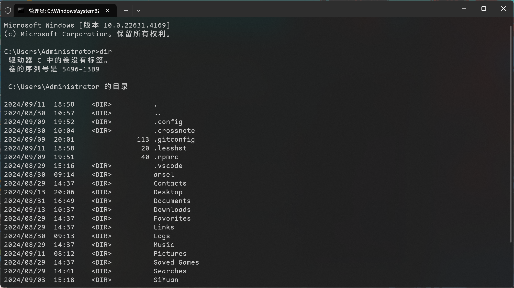
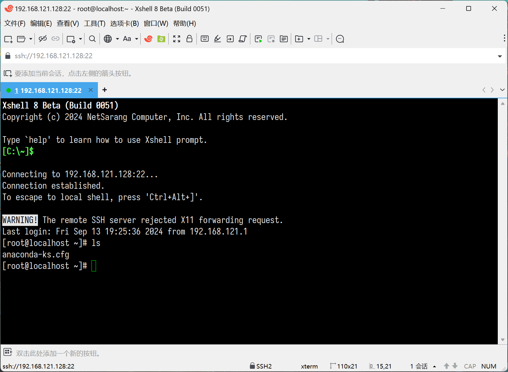

# 终端与命令行

大多数服务器运行的都是 Linux 系统，而服务器通常不提供图形用户界面（GUI），而是通过命令行进行管理。而且远程连接服务器时，通常只能通过命令行界面进行操作。即使服务器支持图形界面，通过 SSH 等协议远程连接时，也只能使用命令行。因此，为了有效地管理服务器，需要掌握 Linux 命令。

## 终端

终端（Terminal），也被称为命令行界面（Command-Line Interface, CLI），是一种用于与计算机操作系统交互的用户界面，它允许用户通过输入文本命令来执行各种操作。与图形用户界面（Graphical User Interface, GUI）相比，终端依赖于文本输入和文本输出。

例如，在 Windows 系统中，可以通过「命令提示符」（cmd）或 PowerShell 来访问类似的界面，例如：



同样，通过 SSH（Secure Shell）远程连接到 Linux 服务器时使用的用户界面通常也被称为终端。SSH 协议允许用户从本地计算机（客户端）安全地访问远程计算机（服务器）的命令行界面：



SSH 终端与本地终端在功能上非常相似，但它们之间的主要区别在于操作发生在远程服务器上，而不是本地计算机上。

## 命令行提示符

通过 SSH 或者是直接登陆系统后，第一眼看到的内容应该是提示信息和提示符：

```bash
Last login: Sat Sep 14 16:46:56 2024 from 192.168.121.1
[root@localhost ~]# 
```

- **提示信息**：`Last login: Sat Sep 14 16:46:56 2024 from 192.168.121.1`，这行信息显示了上次登录的时间和来源 IP 地址。

重点关注的是命令行的提示符，命令行提示符是在命令行界面（CLI）中，操作系统显示并等待用户输入命令的文本字符串。它通常由以下几部分组成：

- 用户名：通常是当前登录用户的用户名。
- 主机名：当前工作的计算机或服务器的主机名。
- 当前工作目录：用户当前所在的目录路径。
- 特殊字符：表明当前用户权限的标志，例如：
  - `#`：表示当前用户是超级用户（root）。
  - `$`：表示当前用户是普通用户。
  - `%`：在某些 shell（如 csh 或 tcsh）中用于普通用户，`#` 用于超级用户。

那么，`[root@localhost ~]#` 这个命令提示符具体含义：

- `[]`：这是提示符的分隔符号，没有特殊含义。
- `root`：显示的是当前的登录用户，也就是使用 root 用户登录。
- `@`：通常用于分隔用户名和主机名，没有特殊含义。
- `localhost`：表示当前正在操作的是本地主机。localhost 是本机的名称，用于标识同一台计算机。
- `~`：表示当前工作目录是 root 用户的家目录，也就是 `/root`。在 Linux 中，`~` 符号用于表示当前用户的家目录。
- `#`：这是提示符的一部分，表示当前用户是超级用户。对于普通用户，这个 `#` 会显示为 `$`。

在 Linux 系统中，每个用户都有一个称为「家目录」（或称主目录）的初始登录位置。家目录是用户在登录系统后默认所在的目录，同时也是用户存放个人文件的地方。用户在自己的家目录中拥有完全的权限，因此建议将个人文件和操作实验放在家目录中进行。以下是家目录的一些规则：

- 超级用户的家目录通常位于 `/root`。
- 普通用户的家目录通常位于 `/home/用户名`。

当用户登录系统后，可以通过切换目录来改变当前工作位置。在 Bash 命令行提示符中，如果用户切换了目录，提示符会相应地变化，显示当前所在目录的路径。例如：

```bash
[root@localhost ~]# cd /usr/local
[root@localhost local]#
```

在这个例子中，初始提示符 `[root@localhost ~]#` 表示 root 用户位于自己的家目录（`~` 表示家目录）。当用户切换到 `/usr/local` 目录后，提示符变为 `[root@localhost local]#`，其中 local 是 `/usr/local` 路径中的最后一个组成部分。

需要注意的是，提示符只显示当前目录的最后一个组件，而不是完整路径，这是为了简洁和方便。如果需要查看完整的当前路径，可以使用 `pwd` 命令。

## 命令行基本语法

```bash
命令 [选项] [参数]
```

- **命令**（command）：这是你需要执行的操作，例如 `ls` 用于列出目录内容，`cd` 用于改变当前工作目录。
- **选项**（options）：这些通常以单个破折号 `-` 或双破折号 `--` 开头，用来修改命令的行为。例如，`-a` 用于显示所有文件，包括隐藏文件。
- **参数**（arguments）：这些是命令操作的对象，比如文件名、目录名或其他命令的输出。

在 Linux 中，命令的选项和参数所使用的符号也有相应的含义：

- `[ ]`：表示方框里的内容是可选的。
- `< >`：表示尖括号里面的内容必须提供。
- `a|b`：二选一，或多选一。
- `...`：前面的内容可重复出现多次。

### 选项作用

选项（也称为开关或标志）用于修改命令的默认行为。它们提供了对命令执行方式的更精细控制。选项通常以连字符 `-` 开头，对于长选项，则通常以两个连字符 `--` 开头。选项可以影响命令的输出格式、处理方式或行为模式。

在 Linux 中使用 `ls` 命令而不加任何选项时，它将执行最基本的功能，即列出当前目录下的文件和目录名。如果添加选项，比如 `-l`，命令的输出会变得更加详细。例如：

```bash
[root@localhost ~]# ls
anaconda-ks.cfg  shell  test.txt
[root@localhost ~]# ls -l
total 4
-rw-------. 1 root root 819 Sep 12 15:45 anaconda-ks.cfg
drwxr-xr-x. 2 root root   6 Sep 16 23:35 shell
-rw-r--r--. 1 root root   0 Sep 16 23:35 test.txt
```

这里的 `-l` 选项表示长格式（long listing），它不仅显示文件名，还显示文件的详细信息，如权限、所有者、大小和时间戳等。

选项的作用是扩展或修改命令的默认行为。没有选项时，命令执行最基本的功能；而有了选项，可以提供更丰富的信息或执行更复杂的任务。Linux 命令的选项通常有两种形式：短选项和长选项。短选项是单字母的简写，通常用单个连字符 `-` 前缀，例如：

```bash
[root@localhost ~]# ls -l
```

长选项则是完整的英文单词，通常用两个连字符 `--` 前缀，例如：

```bash
[root@localhost ~]# ls --all
```

短选项通常是长选项的缩写形式，但并非所有短选项都有对应的长选项。例如，`ls` 命令的 `-l` 选项就没有对应的长选项。

要了解命令的特定选项和它们的详细含义，可以使用帮助命令，如 `man` 或 `--help`，来查询。例如：

```bash
[root@localhost ~]# man ls
LS(1)                                            User Commands                                           LS(1)

NAME
       ls - list directory contents

SYNOPSIS
       ls [OPTION]... [FILE]...

DESCRIPTION
       List  information  about  the FILEs (the current directory by default).  Sort entries alphabetically if
       none of -cftuvSUX nor --sort is specified.
……
```

> [!NOTE]
> `man` 是一个用于查看在线帮助手册的命令。它提供了关于系统上可用的命令、函数、常量等的详细文档。

或者使用 `--help` 选项：

```bash
[root@localhost ~]# ls --help
Usage: ls [OPTION]... [FILE]...
List information about the FILEs (the current directory by default).
Sort entries alphabetically if none of -cftuvSUX nor --sort is specified.

Mandatory arguments to long options are mandatory for short options too.
  -a, --all                  do not ignore entries starting with .
  -A, --almost-all           do not list implied . and ..
……
```

这些帮助命令将提供关于如何使用该命令以及各个选项的详细说明。

### 参数作用

在命令行界面中，参数是传递给命令的值，它们定义了命令执行的具体细节。参数通常用于指定命令作用的对象，如文件、目录或搜索模式，以及如何执行命令。

假设想将文件 test.txt 其重命名为 newname.txt。在这个过程中，需要提供两个参数给 `mv` 命令：当前文件名和希望更改为的新文件名。

```bash
[root@localhost ~]# mv test.txt newname.txt
[root@localhost ~]# ls
anaconda-ks.cfg  newname.txt  shell
```

在这个例子中：

- `mv` 是命令，用于移动或重命名文件和目录。
- `test.txt` 是第一个参数，指定了要重命名的源文件。
- `newname.txt` 是第二个参数，指定了文件的新名称。

执行这个命令后，当前目录下的 test.txt 文件将被重命名为 newname.txt。

如果没有提供参数，系统将无法执行命令，因为它不知道要对哪个文件进行操作，以及要执行什么操作。参数是命令执行所必需的，它们告诉命令具体要操作的文件或目录，以及如何执行操作。在这个重命名文件的上下文中，第一个参数是告诉 `mv` 命令目标文件当前的位置和名称，第二个参数是指定目标文件在重命名后应有的新位置和名称。如果只提供了一个参数，或者没有提供任何参数，`mv` 命令将无法执行，因为它缺少必要的信息来完成操作。

但是有的命令可以在没有参数的情况下执行。当没有提供参数时，它们会执行这些默认行为，例如在命令行中执行 `ls` 命令而未指定任何参数时，它会采用默认参数，即当前工作目录。因此，它会显示当前目录中的文件和目录列表。

