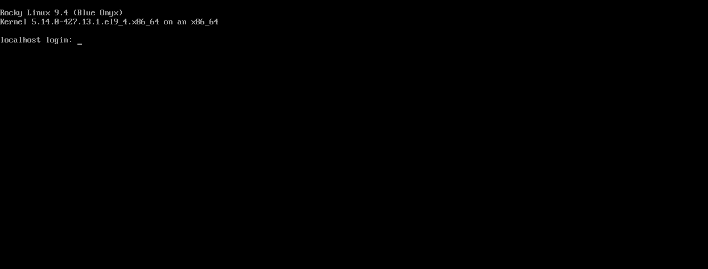
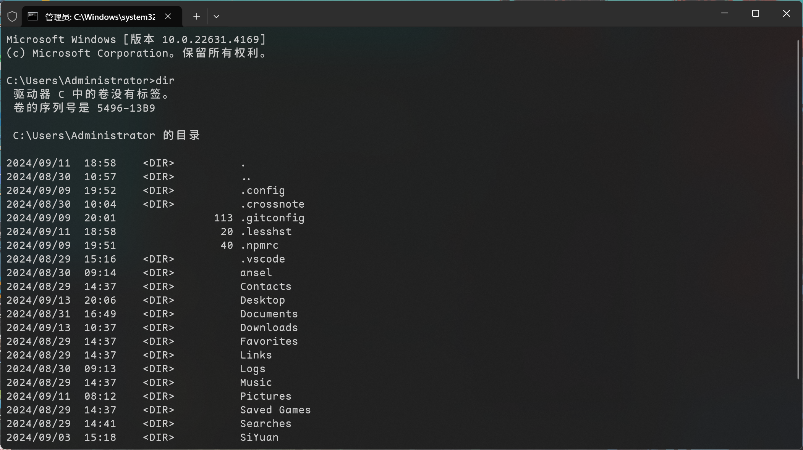
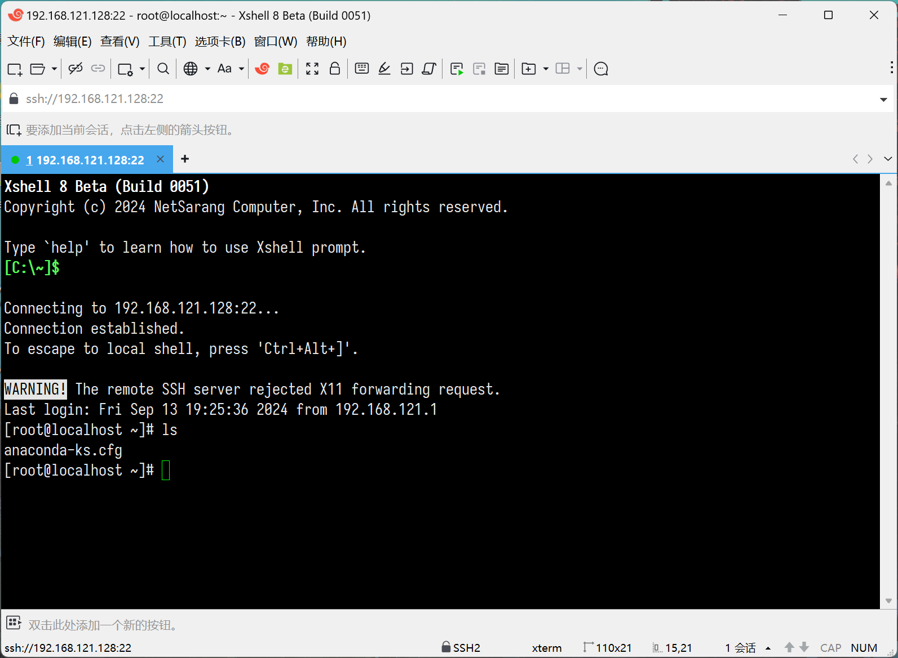
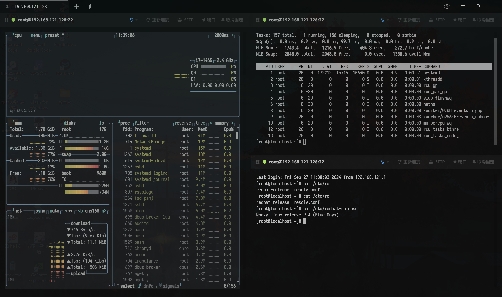

# 终端

在 Linux 系统中，终端（Terminal）是一个非常重要的组件，它提供了一个用户与操作系统交互的文本界面。终端是一个程序，它允许用户通过键盘输入命令，这些命令会被发送到操作系统进行处理，然后返回结果给用户。终端是基于文本的，与图形用户界面（GUI）相比，它更依赖于命令行界面（CLI）。

终端的概念起源于早期的计算机系统，当时的计算机没有图形界面，用户通过打字机式的终端设备与计算机交互。随着技术的发展，现代计算机系统已经集成了图形用户界面，但终端仍然被广泛使用，因为它提供了一种高效、灵活的操作方式。

> [!NOTE]
> 在没有图形化界面的系统（如服务器或最小化安装的 Linux 系统）中，默认就是终端界面。用户可以通过本地或远程终端直接与系统交互。

## 终端分类

终端的分类可以根据其使用方式和接入方式来区分：

- 本地终端（Local Terminal）
- 远程终端（Remote Terminal）

在图形用户界面（GUI）操作系统中，用户可以通过启动终端仿真器（如 Windows 的命令提示符或 PowerShell，macOS 的 Terminal.app）来访问本地终端。

例如，在 Windows 系统中，可以通过「命令提示符」（cmd）或 PowerShell 来访问类似的界面，例如：

> [!TIP] 终端仿真器
> 终端仿真器（Terminal Emulator）是一种软件程序，它模拟了物理终端的行为，提供了一个用户与计算机操作系统交互的文本界面。

通过网络连接到远程计算机的终端。用户可以在本地计算机上使用 SSH 或其它远程登录协议来连接到远程服务器的终端。一般远程 Linux 服务器都是通过 SSH（Secure Shell）远程连接的，SSH 协议允许用户从本地计算机（客户端）安全地访问远程计算机（服务器）的命令行界面：

远程终端和本地终端在功能上确实非常相似，它们都提供了一个命令行界面（CLI）供用户与操作系统交互。

## 多端访问

Linux 支持多终端访问，这意味着可以在同一台 Linux 系统上同时打开和使用多个终端会话。这种能力提供了极大的灵活性和效率，尤其适合需要同时执行多个任务或监控多个进程的用户。

而且 Linux 是一个多用户操作系统，多个用户可以同时登录并使用系统。每个用户可以有自己的终端会话，互不干扰。

## 命令行快捷键

Linux 中终端内置了很多快捷键，从而方便操作。Linux 命令行终端的快捷键大概可以分为以下几类，即：调用历史命令、移动、复制粘贴、剪切、删除、转换和其他快捷键。

| 历史命令快捷键 | 说明                                                                                                                                      |
| -------------- | ----------------------------------------------------------------------------------------------------------------------------------------- |
| Ctrl+r         | 开始增量历史命令搜索，可以按照关键字查自己用过哪些命令，输入若干字符，开始向上搜索包含该字符的命令，继续按 Ctrl+r，搜索上一条匹配的命令。 |
| !num           | 执行命令历史列表的第 num 条命令。                                                                                                         |
| !!             | 执行上一条命令。                                                                                                                          |
| !str           | 执行最近的一条以 str 开始的命令。                                                                                                         |
| !?string?      | 执行含有 string 字符串的最新命令。                                                                                                        |
| ls !$          | 执行命令 ls，并以上一条命令的参数为其参数。                                                                                               |
| ↑ (Ctrl+p)     | 显示上一条命令。                                                                                                                          |
| ↓ (Ctrl+n)     | 显示下一条命令。                                                                                                                          |
| esc+.          | 上次输入的最后一个单词。                                                                                                                  |

| 复制粘贴快捷键   | 说明       |
| ---------------- | ---------- |
| Ctrl + Shift + C | 复制命令。 |
| Ctrl + Shift + V | 粘贴命令。 |
| Ctrl + Insert    | 复制命令。 |
| Shift + Insert   | 粘贴命令。 |

| 剪切快捷键 | 说明                                                   |
| ---------- | ------------------------------------------------------ |
| Ctrl + k   | 剪切命令行中光标所在处之后的所有字符（包括自身）。     |
| Ctrl + u   | 剪切命令行中光标所在处之前的所有字符（不包括自身）。   |
| Ctrl + w   | 剪切光标所在处之前的一个词（以空格、标点等为分隔符）。 |
| Alt + d    | 剪切光标之后的词。                                     |

| 删除快捷键 | 说明                                                           |
| ---------- | -------------------------------------------------------------- |
| Ctrl + l   | 清屏。                                                         |
| Ctrl + W   | 清除光标之前一个单词。                                         |
| Ctrl + K   | 清除光标到行尾的字符。                                         |
| Ctrl + U   | 删除光标前面的部分。                                           |
| Ctrl + y   | 粘贴刚才所删除的字符。                                         |
| Ctrl + d   | 删除光标所在处字符。                                           |
| Ctrl + h   | 删除光标所在处前一个字符。                                     |
| Esc + w    | 删除光标所在处之前的字符至其单词尾（以空格、标点等为分隔符）。 |

| 转换快捷键   | 说明                                                         |
| ------------ | ------------------------------------------------------------ |
| Ctrl + t     | 颠倒光标所在处及其之前的字符位置，并将光标移动到下一个字符。 |
| Alt + t      | 交换当前与以前单词的位置。                                   |
| Alt + u      | 把当前词转化为大写。                                         |
| Alt + l      | 把当前词转化为小写。                                         |
| Alt + c      | 把当前词汇变成首字符大写。                                   |
| Ctrl + v     | 插入特殊字符，如 Ctrl+v+Tab 加入 Tab 字符键。                |
| Esc + t      | 颠倒光标所在处及其相邻单词的位置。                           |
| Ctrl + (x u) | 按住 Ctrl 的同时再先后按 x 和 u，撤销刚才的操作。            |

| 其他快捷键 | 说明                                                                       |
| ---------- | -------------------------------------------------------------------------- |
| Ctrl + d   | 从 shell 提示中注销（并关闭）。使用该快捷键，就不必键入 exit 或 logout。 |
| Ctrl + c   | 终止当前正在运行的程序。                                                   |
| Ctrl + s   | 停止向屏幕输出，挂起当前 shell。                                           |
| Ctrl + q   | 重新激活向屏幕输出，重新启用挂起的 shell。                                 |
| Ctrl + Z   | 暂停程序。                                                                 |
