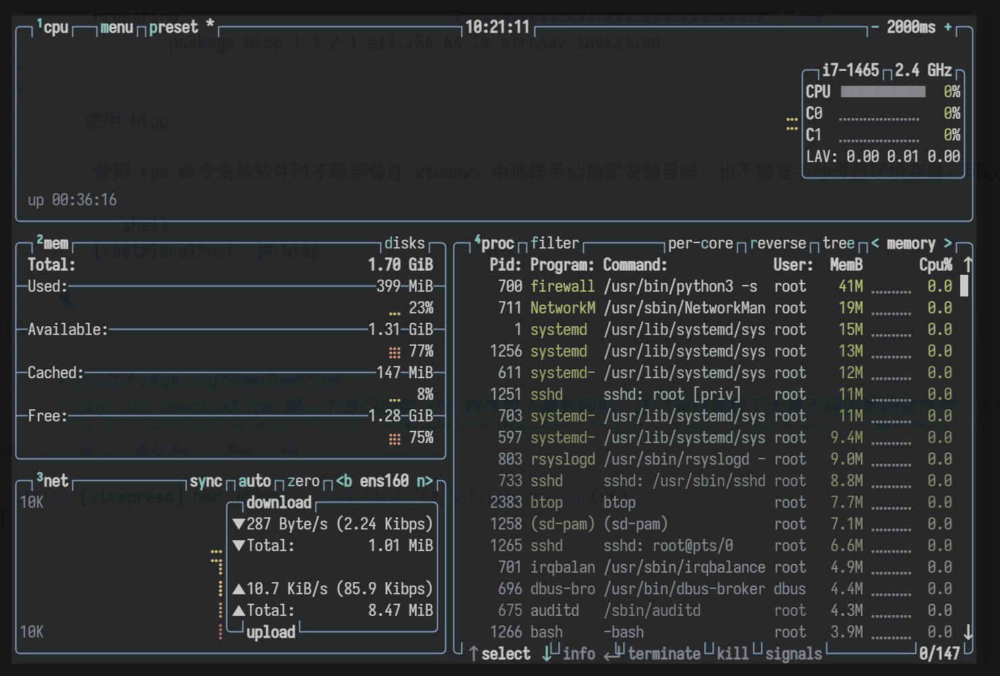

# RPM 包管理系统

RPM Package Manager (RPM) 是一个强大的软件包管理系统，它运行在 Red Hat Enterprise Linux (RHEL)、CentOS 和 Fedora 等 Linux 发行版上。RPM 使得用户能够分发、管理和更新软件包，为这些操作系统提供了一种高效的软件管理解决方案。与传统的存档文件分发软件相比，RPM 软件包管理系统带来了以下显著优势：

- RPM 以可独立安装、更新或删除的软件包形式管理软件，从而更轻松地维护操作系统。
- RPM 简化了软件的分发，因为 RPM 软件包是独立的二进制文件，类似于压缩存档。这些软件包是为特定的操作系统和硬件架构构建的。RPM 包含诸如已编译的可执行文件和库等文件，这些文件在安装软件包时被放在文件系统上的适当路径下。

使用 RPM，用户可以执行以下操作：

- 安装、升级和删除软件包。
- 查询关于软件包的详细信息。
- 验证软件包的完整性和校验和。
- 从源代码构建软件包，并生成构建文档。
- 使用 GNU Privacy Guard (GPG) 工具对软件包进行数字签名，确保软件的安全性和可信度。
- 在 DNF 存储库中发布软件包，便于软件的共享和分发。

RPM 提供了一种可靠和高效的方式来管理 Linux 系统中的软件包，它的集成和自动化功能减少了手动操作的复杂性，同时确保了软件的一致性和可靠性。

## 命名规则

RPM 包的命名遵循一套特定的规则，这些规则帮助用户识别包的名称、版本、发布号以及支持的架构。一个典型的 RPM 包命名格式如下：

```shell
Package Name-Version-Release.Architecture.rpm
```

以下是各个部分的详细说明：

- 包名（Package Name）：这是软件包的名称，如 httpd、nginx 等。
- 版本号（Version）：表示软件的版本，通常格式为主版本号。次版本号。修订号，例如 2.2.15。
- 发布号（Release）：表示该版本的软件包被发布或修订的次数，每次软件包更新、修复或重新编译后，这个数字会增加，以反映软件包的新版本。发布号中可能包含特定的发行版标识符，如 el7 或 fc4，这些标识符指示软件包是为特定的 Linux 发行版构建的。例如，el7 表示 Red Hat Enterprise Linux 7 或 CentOS 7。
- 架构（Architecture）：表示软件包支持的硬件架构，如 x86_64、aarch64 等。对于不依赖特定硬件架构的软件包，使用 noarch 表示。
- 扩展名（.rpm）：表示这是一个 RPM 包。

例如，`nginx-1.20.1-16.el9_4.1.x86_64.rpm` 这个包名可以这样解读：是一个适用于 64 位 x86 架构的 Nginx 软件包，版本为 1.20.1，已经发布了 16 次，并且是为 Red Hat Enterprise Linux 9 或兼容发行版构建的。

> [!NOTE]
> 此外，还有以 `src.rpm` 作为扩展名的 RPM 包，这表明是源代码包，需要安装生成源码，然后对其编译并生成 rpm 格式的包，最后才能使用 rpm 命令进行安装。

常见的架构：

| 架构名称 | 适用平台信息                                                                                                                                                    |
| -------- | --------------------------------------------------------------------------------------------------------------------------------------------------------------- |
| x86_64   | 64 位 x86 架构，适用于大多数现代的 PC 和服务器。                                                                                                                |
| i386     | 32 位 x86 架构，虽然随着技术的发展正逐步被淘汰，但在一些老旧系统或特定应用场景中仍有其用武之地。                                                                |
| aarch64  | 64 位 ARM 架构，主要用于苹果 M1、M2 芯片以及其它基于 ARMv8 指令集的处理器，为移动设备和高性能计算提供了高效的处理能力。                                         |
| arm      | 32 位 ARM 架构，主要适用于一些旧的 ARM 处理器，不支持硬件浮点单元（FPU），如 ARMv6 及之前的处理器。                                                             |
| armhf    | 32 位 ARM 架构，适用于较新的 32 位 ARM 处理器，至少实现了 ARMv7 架构，并支持 ARM 矢量浮点规范（VFPv3）第 3 版。此架构可利用这些型号上可用的扩展和性能增强功能。 |
| noarch   | 表示软件包不依赖于特定的硬件架构，这类软件通常包括脚本程序、配置文件、文档或某些编程语言的解释器，因此可以在多种不同的系统架构上运行。                          |

> [!TIP] 架构
> 32 位架构和 64 位架构主要指的是计算机处理器（CPU）的数据处理宽度，这个宽度决定了处理器一次能处理的数据量。
>
> 现在大多数新的计算机系统都是基于 64 位架构的，因为它们提供了更好的性能和更大的地址空间。这使得 64 位系统能够更有效地处理大型数据集和复杂的计算任务，尤其是对于内存密集型的应用，如数据库、图形处理和科学计算等。
>
> 尽管如此，32 位系统和软件在某些特定领域（如某些嵌入式系统、老旧的软件和操作系统）仍然存在。但在主流市场上，64 位架构已经成为标准，大多数新软件和操作系统都默认支持 64 位架构。

## rpm 语法

`rpm` 命令是 Red Hat Package Manager（RPM）软件包的管理工具，它被广泛用于基于 RPM 的 Linux 发行版，如 Red Hat Enterprise Linux、CentOS、Fedora 和 OpenSUSE 等。RPM 是一种软件包格式，它允许用户安装、卸载、升级、查询和验证软件包。

```shell
rpm [OPTION...] [Package]
```

| 查询/验证软件包选项 | 作用                                 |
| ------------------- | ------------------------------------ |
| `-a`                | 查询或验证所有已安装的软件包。       |
| `-f`                | 用于查询拥有特定已安装文件的软件包。 |
| `-p`                | 查询或验证一个软件包文件。           |
| `-q`                | 查询已安装的软件包信息。             |
| `-V`                | 验证已安装软件包的文件完整性。       |

| 查询文件选项 | 作用                                 |
| ------------ | ------------------------------------ |
| `-c`         | 只显示与已安装软件包相关的配置文件。 |
| `-d`         | 只显示与已安装软件包相关的文档文件。 |
| `-L`         | 只显示与已安装软件包相关的许可文件。 |
| `-A`         | 只显示与已安装软件包相关的构件文件。 |

| 查询选项（与 `-q` 起使用） | 作用                 |
| -------------------------- | -------------------- |
| `-l`                       | 列出软件包中的文件。 |
| `-s`                       | 显示列出文件的状态   |

| 验证选项（与 `-V` 起使用） | 作用                   |
| -------------------------- | ---------------------- |
| `--nofiledigest`           | 不验证文件的摘要。     |
| `--nofiles`                | 不验证软件包中的文件。 |
| `--nodeps`                 | 不验证软件包依赖。     |

| 安装/升级/移除选项 | 作用                                     |
| ------------------ | ---------------------------------------- |
| `-i`               | 安装软件包。                             |
| `-U`               | 升级软件包，如果软件包已安装，则更新它。 |
| `-F`               | 如果软件包已安装，则更新它，否则不安装。 |
| `-e`               | 移除（卸载）软件包。                     |
| `--allfiles`       | 安装所有文件，包括可能会跳过的配置文件。 |
| `--nodeps`         | 不验证软件包依赖。                       |
| `--noscripts`      | 不执行软件包脚本。                       |

| 通用选项  | 作用                 |
| --------- | -------------------- |
| `-v`      | 提供更详细的输出。   |
| `-h`      | 显示进度条           |
| `--quiet` | 提供较少的详细输出。 |
| `--help`  | 显示帮助信息。       |

| 高级选项        | 作用               |
| --------------- | ------------------ |
| `-D`            | 定义宏。           |
| `-E`            | 打印宏的展开。     |
| `-r`            | 指定根目录。       |
| `--dbpath`      | 指定数据库路径。   |
| `--noplugins`   | 不启用任何插件。   |
| `--nosignature` | 不验证软件包签名。 |

| 参数      | 作用                                                                         |
| --------- | ---------------------------------------------------------------------------- |
| `Package` | 表示可以是一个或多个软件包文件（通常是 `.rpm` 文件）或者已安装软件包的名称。 |

### RPM 包安装

RPM 软件包的安装可以使用程序 `rpm` 来完成，例如：

```shell
rpm -ivh package_name.rpm...
```

在这个命令中：

- `-i`：表示安装软件包。
- `-v`：表示详细模式，它会显示更多的信息。
- `-h`：表示显示安装进度条。
- `package_name.rpm`：安装的 RPM 包的文件名。

在安装 RPM 软件包时，如果需要对安装过程进行特殊调整，可以使用以下选项：

| 选项             | 作用                                                                                                                                                                                                                                                                                                        |
| ---------------- | ----------------------------------------------------------------------------------------------------------------------------------------------------------------------------------------------------------------------------------------------------------------------------------------------------------- |
| `-nodeps`        | 忽略依赖性。通常 RPM 会检查软件包的依赖性，确保所有必需的底层软件已经安装。使用此选项可以忽略依赖性检查，强制安装软件包。但请注意，忽略依赖性可能导致软件无法正常使用，因此不推荐在生产环境中使用此选项。                                                                                                   |
| `--replacefiles` | 替换已存在的文件。在安装软件包时，如果目标路径上已有同名文件，RPM 默认会拒绝安装。使用 `--replacefiles` 选项可以覆盖这些已存在的文件，继续安装过程。                                                                                                                                                        |
| `--replacepkgs`  | 替换已安装的软件包。如果软件包已经安装，使用此选项可以忽略错误并重新安装该软件包。                                                                                                                                                                                                                          |
| `--force`        | 强制安装。此选项结合了 `--replacefiles` 和 `--replacepkgs` 的功能，强制覆盖已安装的文件和软件包。                                                                                                                                                                                                           |
| `--test`         | 测试安装。此选项用于模拟安装过程，不会实际更改系统状态，主要用于检查安装是否会成功，包括依赖性检查。                                                                                                                                                                                                        |
| `--prefix`       | 指定安装路径。选项用于为那些设计为可重定位的软件包设置一个新的安装前缀路径。如果一个软件包被设计为可重定位，那么使用 `--prefix` 选项可以改变所有相对路径，使得软件包安装到一个非标准的位置。例如，一个软件包默认可能安装到 `/usr/local/myapp`，使用 `--prefix=/opt` 可以将所有相关文件安装到 `/opt/myapp`。 |
| `--relocate`     | 提供更细粒度的控制，允许为软件包内的特定目录指定新的安装位置。例如，一个软件包包含了 `/usr/bin` 和 `/usr/share` 两个目录的文件，可以使用 `--relocate` 将 `/usr/bin` 映射到 `/opt/bin`，同时将 `/usr/share` 映射到 `/var/share`。                                                                            |
| `--allfiles`     | 安装软件包时包括所有文件，即使某些文件通常因为安全或配置的原因而被排除在外。默认情况下，rpm 在安装软件包时可能会跳过某些被认为是配置文件的安装，使用 `--allfiles` 可以确保这些文件也被安装到系统中。                                                                                                        |
| `--noscripts`    | 在安装、卸载或升级软件包时不执行任何脚本。RPM 允许在软件包中包含脚本，这些脚本在安装、卸载或升级过程中的特定时刻执行。使用 `--noscripts` 可以防止这些脚本被执行。                                                                                                                                           |

安装步骤：

1. 下载 RPM 软件包

    首先，需要获取想要安装的软件的 `.rpm` 文件。这通常可以通过软件开发商的网站或者包管理网站来完成。

    例如，这里下载 btop 软件，下载地址 <https://dl.fedoraproject.org/pub/epel/9/Everything/x86_64/Packages/b/btop-1.3.2-1.el9.x86_64.rpm>。

    可以选择直接在服务器上通过 `wget` 或 `curl` 等工具下载，也可以先在本地下载后再通过远程终端工具上传至服务器。

    ```shell
    [root@localhost ~]# curl -O https://dl.fedoraproject.org/pub/epel/9/Everything/x86_64/Packages/b/btop-1.3.2-1.el9.x86_6
    4.rpm
    % Total    % Received % Xferd  Average Speed   Time    Time     Time  Current
                                    Dload  Upload   Total   Spent    Left  Speed
    100  584k  100  584k    0     0   259k      0  0:00:02  0:00:02 --:--:--  259k
    ```

    ```shell
    [root@localhost ~]# ls
    btop-1.3.2-1.el9.x86_64.rpm
    ```

    > [!TIP] btop
    > btop 是一个开源的系统监控工具，它提供了一个直观且美观的界面来实时显示 Linux 系统中的 CPU、内存、磁盘、网络和进程的使用情况。它相当于是 Linux 系统中的高级替代品，类似于 Windows 中的任务管理器，但提供了更多的功能和更现代化的用户界面。

2. 使用 `rpm` 命令安装

    使用终端或命令行界面，导航到包含 `.rpm` 文件的目录，然后使用 `rpm` 命令进行安装。

    ```shell
    [root@localhost ~]# rpm -ivh btop-1.3.2-1.el9.x86_64.rpm 
    warning: btop-1.3.2-1.el9.x86_64.rpm: Header V4 RSA/SHA256 Signature, key ID 3228467c: NOKEY
    Verifying...                          ################################# [100%]
    Preparing...                          ################################# [100%]
            package btop-1.3.2-1.el9.x86_64 is already installed
    ```

    注意，直到出现两个 100% 才是真正的安装成功，第一个 100% 仅表示完成了安装准备工作。

3. 使用 btop

    使用 `rpm` 命令安装软件时不需要像在 Windows 中那样手动指定安装目录，也不需要手动设置环境变量，因为软件包在设计时通常会包含其可执行文件、库文件、配置文件等所需的路径信息。

    可以直接在命令行执行 `btop`

    ```shell
    [root@localhost ~]# btop
    ```

    

> [!TIP] pkgs.org/download/rpm
> pkgs.org/download/rpm 是一个专门提供 RPM 软件包下载的网址。这个网站收集了大量不同版本的软件包，支持快速搜索和提供详细的软件包信息，包括软件包的描述、版本号、所需依赖和安装方式等。用户可以通过这个网站来查找、下载所需的 RPM 软件包，特别是当需要离线安装软件或者在官方仓库中找不到所需软件包时，这个网站可以提供很大的帮助。
>
> pkgs.org 是一个提供 Linux 和 BSD 操作系统软件包的包管理网站。

### RPM 包升级

RPM 包的升级可以通过 `rpm` 命令来完成：

```shell
rpm -Uvh package_name.rpm
```

- `-U`: 用于更新已安装的软件包或安装新软件包。

```shell
rpm -Fvh package_name.rpm
```

- `-F`: 仅升级那些已经安装在系统上的软件包。如果指定的软件包没有安装，RPM 不会安装它，只有当软件包已经安装，并且提供了一个更新的版本时，RPM 才会执行升级操作。

### RPM 包卸载

RPM 包的卸载可以通过 `rpm` 命令来完成：

```shell
rpm -e package_name
```

- `-e`: 表示卸载。

需要注意，RPM 软件包的卸载要考虑包之间的依赖性。在 Linux 系统中，软件包之间可能存在依赖关系。这意味着一个软件包可能依赖于另一个或多个软件包才能正常工作。这种依赖关系确保了软件的各个组件能够协同工作，提供所需的功能。

> [!WARNING]
> 如果其他软件包依赖于想要卸载的软件包，那么在卸载之前，需要决定如何处理这些依赖关系。如果强制卸载，可能会导致依赖它的软件包无法正常工作。除了直接依赖外，还可能存在间接依赖。例如，软件包 A 依赖于软件包 B，而软件包 B 又依赖于想要卸载的软件包。在这种情况下，卸载操作可能会影响到软件包 A 和 B。

在卸载软件包时，系统会尝试解决依赖性问题。如果系统能够自动解决依赖问题（例如，通过安装替代的软件包或移除依赖的软件包），那么卸载操作可以顺利进行。否则，系统会提示依赖性问题，并阻止卸载。

在某些情况下，可能需要卸载一个软件包，即使它被其他软件包依赖。这时，可以使用 `--nodeps` 选项来强制卸载软件包，但这可能会导致依赖它的软件包出现问题。所以在卸载软件包之前，可以使用 `rpm -qR` 命令来检查软件包的依赖关系。这可以了解哪些软件包依赖于想要卸载的软件包。

例如，查看一个 httpd 软件包所需的依赖（httpd 默认系统没有安装的）：

```shell
[root@localhost ~]# rpm -qR httpd
/bin/sh
config(httpd) = 2.4.57-11.el9_4.1
httpd-core = 0:2.4.57-11.el9_4.1
libbrotlienc.so.1()(64bit)
libc.so.6()(64bit)
libc.so.6(GLIBC_2.2.5)(64bit)
libc.so.6(GLIBC_2.4)(64bit)
libsystemd.so.0()(64bit)
libsystemd.so.0(LIBSYSTEMD_209)(64bit)
rpmlib(CompressedFileNames) <= 3.0.4-1
rpmlib(FileDigests) <= 4.6.0-1
rpmlib(PayloadFilesHavePrefix) <= 4.0-1
rpmlib(PayloadIsZstd) <= 5.4.18-1
rtld(GNU_HASH)
system-logos-httpd
systemd-units
```

- `config(httpd) = 2.4.57-11.el9_4.1` 和 `httpd-core = 0:2.4.57-11.el9_4.1` 表示 httpd 软件包自身的配置和核心组件的版本。
- `libbrotlienc.so.1()(64bit)` 表示需要 libbrotlienc 库的版本 1 的 64 位版本。
- `libc.so.6()(64bit)` 和 `libc.so.6(GLIBC_2.2.5)(64bit)` 以及 `libc.so.6(GLIBC_2.4)(64bit)` 表示需要 C 标准库（libc）的版本 6 的 64 位版本，并且这个版本需要支持 GLIBC 版本 2.2.5 和 2.4。
- `libsystemd.so.0()(64bit)` 和 `libsystemd.so.0(LIBSYSTEMD_209)(64bit)` 表示需要 libsystemd 库的版本 0 的 64 位版本，且该版本需要支持 LIBSYSTEMD_209 接口。
- `rpmlib(CompressedFileNames) <= 3.0.4-1` 等条目是 RPM 软件包管理器的特定需求，它们要求系统中的 RPM 库版本至少为 3.0.4-1。
- `rtld(GNU_HASH)` 表示需要一个支持 GNU_HASH 的运行时链接器。
- `system-logos-httpd` 和 `systemd-units` 表示依赖于特定的系统图标和 systemd 服务单元文件。

这个列表中的每个条目都代表了 httpd 软件包在运行时或安装时可能需要的某个特定组件的特定版本。如果系统中缺少这些依赖，或者版本不兼容，那么 httpd 可能无法正确安装或运行。

当使用 rpm -e 卸载 httpd 软件包的时候会出现报错：

```shell
[root@localhost ~]# rpm -e httpd
error: Failed dependencies:
        httpd >= 2.4.51-7 is needed by (installed) mod_http2-2.0.26-2.el9_4.x86_64
```

这个错误信息表明尝试从系统中卸载 httpd 软件包时遇到了依赖性问题。具体来说，有一个已经安装的软件包 `mod_http2-2.0.26-2.el9_4.x86_64` 依赖于 httpd 软件包，并且需要的是版本 2.4.51-7 或更高版本的 httpd。

由于系统中安装的 httpd 版本是 `2.4.57-11.el9_4.1`，它满足了 mod_http2 所需的最低版本要求，但是 rpm 命令不允许卸载 httpd，因为这样做会破坏 mod_http2 的依赖性，导致它无法正常工作。

要解决这个问题，可以选择下面几个选项：

- 不卸载 httpd：如果 httpd 对于系统的其他部分不是必需的，那么可以保留它。
- 卸载 mod_http2：如果 mod_http2 不是必需的，可以先卸载它，然后再尝试卸载 httpd。使用以下命令来卸载 mod_http2：

    ```shell
    [root@localhost ~]# rpm -e mod_http2
    ```

- 强制卸载：如果确定要卸载 httpd 并且愿意承担由此可能引起的系统不稳定或其他问题，可以使用 `--nodeps` 选项来强制卸载，但这是不推荐的：

    ```shell
    [root@localhost ~]# rpm -e --nodeps httpd
    ```

    在处理依赖性问题时，一定要谨慎，确保了解每个步骤可能带来的后果。

- 使用包管理器：推荐使用 yum 或 dnf 包管理器，它们可以更好地处理依赖关系。例如，使用以下命令：

    ```shell
    [root@localhost ~]# dnf -y remove httpd
    ```

> [!TIP] 依赖性
> 在 Linux 系统中，软件包依赖性（Dependency）是指一个软件包在安装、升级或运行时所需要的其他软件包或库文件。依赖性的存在是为了确保软件能够正常编译、安装和执行。这些依赖确保了软件能够顺利运行，因为它们提供了必要的代码和资源。如果没有这些依赖，软件可能无法正常工作，就像缺少了一些关键部分的拼图无法完整一样。

### RPM 包查询

`rpm` 命令还可用来对 RPM 软件包做查询操作，具体包括：

- 查询软件包是否已安装；
- 查询系统中所有已安装的软件包；
- 查看软件包的详细信息；
- 查询软件包的文件列表；
- 查询某系统文件具体属于哪个 RPM 包。

示例：

1. 查询软件包是否已安装

    使用 `rpm -q` 命令可以检查指定的软件包是否已在系统中安装。如果已安装，它会显示软件包的版本和发布信息：

    ```shell
    [root@localhost ~]# rpm -q btop
    btop-1.3.2-1.el9.x86_64
    ```

2. 查询系统中所有已安装的软件包

    通过 `rpm -qa` 命令可以列出系统中所有已安装的 RPM 软件包。这个列表通常包括软件包的名称、版本、发布号和架构：

    ```shell
    [root@localhost ~]# rpm -qa
    libgcc-11.4.1-3.el9.x86_64
    linux-firmware-whence-20240219-143.el9.noarch
    crypto-policies-20240202-1.git283706d.el9.noarch
    tzdata-2024a-1.el9.noarch
    linux-firmware-20240219-143.el9.noarch
    rocky-gpg-keys-9.4-1.5.el9.noarch
    rocky-release-9.4-1.5.el9.noarch
    ……
    ```

3. 查看软件包的详细信息

    使用 `rpm -qi` 命令可以查看已安装软件包的详细信息，包括包的名称、版本、描述、构建日期、包大小、许可证、供应商和相关文档的位置等：

    ```shell
    [root@localhost ~]# rpm -qi btop
    Name        : btop
    Version     : 1.3.2
    Release     : 1.el9
    Architecture: x86_64
    Install Date: Fri Oct 11 10:08:49 2024
    Group       : Unspecified
    Size        : 1667047
    License     : Apache-2.0 and MIT and Public Domain
    Signature   : RSA/SHA256, Tue Feb 13 11:39:49 2024, Key ID 8a3872bf3228467c
    Source RPM  : btop-1.3.2-1.el9.src.rpm
    Build Date  : Tue Feb 13 11:24:16 2024
    Build Host  : buildvm-x86-10.iad2.fedoraproject.org
    Packager    : Fedora Project
    Vendor      : Fedora Project
    URL         : https://github.com/aristocratos/btop
    Bug URL     : https://bugz.fedoraproject.org/btop
    Summary     : Modern and colorful command line resource monitor that shows usage and stats
    Description :
    Resource monitor that shows usage and stats for processor,
    memory, disks, network and processes.

    C++ version and continuation of bashtop and bpytop.
    ```

4. 查询软件包的文件列表

    `rpm -ql` 命令可以列出一个已安装软件包的所有文件及其路径：

    ```shell
    [root@localhost ~]# rpm -ql btop
    /usr/bin/btop
    /usr/lib/.build-id
    /usr/lib/.build-id/8e
    /usr/lib/.build-id/8e/bf501d14b42232438380565c64bc8c269a8faa
    /usr/share/applications/btop.desktop
    /usr/share/btop
    /usr/share/btop/themes
    /usr/share/btop/themes/HotPurpleTrafficLight.theme
    /usr/share/btop/themes/adapta.theme
    /usr/share/btop/themes/adwaita.theme
    /usr/share/btop/themes/ayu.theme
    /usr/share/btop/themes/dracula.theme
    /usr/share/btop/themes/dusklight.theme
    /usr/share/btop/themes/elementarish.theme
    /usr/share/btop/themes/everforest-dark-hard.theme
    /usr/share/btop/themes/everforest-dark-medium.theme
    /usr/share/btop/themes/flat-remix-light.theme
    /usr/share/btop/themes/flat-remix.theme
    /usr/share/btop/themes/greyscale.theme
    /usr/share/btop/themes/gruvbox_dark.theme
    /usr/share/btop/themes/gruvbox_dark_v2.theme
    /usr/share/btop/themes/gruvbox_material_dark.theme
    /usr/share/btop/themes/horizon.theme
    /usr/share/btop/themes/kyli0x.theme
    /usr/share/btop/themes/matcha-dark-sea.theme
    /usr/share/btop/themes/monokai.theme
    /usr/share/btop/themes/night-owl.theme
    /usr/share/btop/themes/nord.theme
    /usr/share/btop/themes/onedark.theme
    /usr/share/btop/themes/paper.theme
    /usr/share/btop/themes/solarized_dark.theme
    /usr/share/btop/themes/solarized_light.theme
    /usr/share/btop/themes/tokyo-night.theme
    /usr/share/btop/themes/tokyo-storm.theme
    /usr/share/btop/themes/tomorrow-night.theme
    /usr/share/btop/themes/whiteout.theme
    /usr/share/doc/btop
    /usr/share/doc/btop/CHANGELOG.md
    /usr/share/doc/btop/README.md
    /usr/share/icons/hicolor/48x48/apps/btop.png
    /usr/share/icons/hicolor/scalable/apps/btop.svg
    /usr/share/licenses/btop
    /usr/share/licenses/btop/LICENSE
    ```

    同时，`rpm` 命令 `-p` 选项（表示查询未安装的软件包信息，是 package 的首字母。）还可以查询未安装软件包中包含的所有文件以及打算安装的路径。注意，由于软件包还未安装，因此需要使用「绝对路径+包全名」的方式才能确定包。

5. 查询某系统文件具体属于哪个 RPM 包：

    如果知道系统中某个文件的路径，可以使用 `rpm -qf` 命令来查询该文件属于哪个 RPM 包：

    ```shell
    [root@localhost doc]# rpm -qf /usr/share/doc/sed
    sed-4.8-9.el9.x86_64
    ```

6. 查询软件包的文档文件

    `rpm -qd` 命令可以列出一个已安装软件包的所有文档文件：

    ```shell
    [root@localhost ~]# rpm -qd btop
    /usr/share/doc/btop/CHANGELOG.md
    /usr/share/doc/btop/README.md
    ```

7. 查询软件包的依赖关系：

    `rpm -qR` 命令可以显示一个已安装软件包的所有依赖关系：

    ```shell
    [root@localhost ~]# rpm -qR btop
    hicolor-icon-theme
    libc.so.6()(64bit)
    libc.so.6(GLIBC_2.14)(64bit)
    libc.so.6(GLIBC_2.2.5)(64bit)
    libc.so.6(GLIBC_2.24)(64bit)
    libc.so.6(GLIBC_2.3)(64bit)
    libc.so.6(GLIBC_2.3.4)(64bit)
    libc.so.6(GLIBC_2.32)(64bit)
    libc.so.6(GLIBC_2.34)(64bit)
    libc.so.6(GLIBC_2.4)(64bit)
    libgcc_s.so.1()(64bit)
    libgcc_s.so.1(GCC_3.0)(64bit)
    libgcc_s.so.1(GCC_3.3.1)(64bit)
    libm.so.6()(64bit)
    libm.so.6(GLIBC_2.2.5)(64bit)
    libstdc++.so.6()(64bit)
    libstdc++.so.6(CXXABI_1.3)(64bit)
    libstdc++.so.6(CXXABI_1.3.11)(64bit)
    libstdc++.so.6(CXXABI_1.3.13)(64bit)
    libstdc++.so.6(CXXABI_1.3.2)(64bit)
    libstdc++.so.6(CXXABI_1.3.3)(64bit)
    libstdc++.so.6(CXXABI_1.3.5)(64bit)
    libstdc++.so.6(CXXABI_1.3.9)(64bit)
    libstdc++.so.6(GLIBCXX_3.4)(64bit)
    libstdc++.so.6(GLIBCXX_3.4.11)(64bit)
    libstdc++.so.6(GLIBCXX_3.4.14)(64bit)
    libstdc++.so.6(GLIBCXX_3.4.15)(64bit)
    libstdc++.so.6(GLIBCXX_3.4.18)(64bit)
    libstdc++.so.6(GLIBCXX_3.4.19)(64bit)
    libstdc++.so.6(GLIBCXX_3.4.20)(64bit)
    libstdc++.so.6(GLIBCXX_3.4.21)(64bit)
    libstdc++.so.6(GLIBCXX_3.4.22)(64bit)
    libstdc++.so.6(GLIBCXX_3.4.26)(64bit)
    libstdc++.so.6(GLIBCXX_3.4.29)(64bit)
    libstdc++.so.6(GLIBCXX_3.4.5)(64bit)
    libstdc++.so.6(GLIBCXX_3.4.9)(64bit)
    rpmlib(CompressedFileNames) <= 3.0.4-1
    rpmlib(FileDigests) <= 4.6.0-1
    rpmlib(PayloadFilesHavePrefix) <= 4.0-1
    rpmlib(PayloadIsZstd) <= 5.4.18-1
    rtld(GNU_HASH)
    ```

    同样，在此命令的基础上增加 `-p` 选项，即可实现查找未安装软件包的依赖性。

## RPM 包验证

RPM 包验证是使用 RPM 工具来检查已安装的 RPM 软件包的完整性和真实性的过程。这通常涉及到验证软件包的签名和校验文件的完整性：

- RPM 包校验：其实就是将已安装文件和 `/var/lib/rpm/` 目录下的数据库内容进行比较，确定文件内容是否被修改。
- RPM 包数字证书校验：用来校验 RPM 包本身是否被修改。

### RPM 包校验

`rpm -V` 命令用于校验系统中已安装的 RPM 包的文件是否被修改或损坏。这个命令会将文件的当前状态与 RPM 数据库中的记录进行比较。如果文件未被修改，命令将不显示任何内容；如果文件被修改，它会显示一个状态码，指示文件的哪些属性被更改了。

例如，可以使用选项 `Va` 表示校验系统中已安装的所有软件包：

```shell
[root@localhost ~]# rpm -Va 
S.5....T.  c /etc/environment
.M.......  c /boot/grub2/grub.cfg
S.5....T.  c /root/.bashrc
```

RPM 的校验码（也称为状态码或验证信息）总共由 9 个字符组成，每个字符都代表文件的某个特定属性是否与 RPM 数据库中的记录匹配。下面是每个字符代表的含义：

1. `S`：文件大小（Size）是否改变。
2. `M`：文件模式（Mode），包括文件类型和权限（例如读、写、执行权限）是否改变。
3. `5`：文件的 MD5 校验和（MD5）是否改变，这通常表示文件内容是否被修改。
4. `D`：设备文件的主要和次要号码（Device major/minor numbers）是否改变，这通常与字符设备或块设备文件相关。
5. `L`：文件的链接（Link），即 readlink(2) 路径是否改变，这通常与符号链接有关。
6. `U`：文件的所有者（User）是否改变。
7. `G`：文件所属的组（Group）是否改变。
8. `T`：文件的修改时间（Time）是否改变。
9. `P`：文件的容量（i 节点的区块使用情况）是否改变。

如果某个属性自 RPM 包安装后未发生变化，则相应的位置会显示一个点（`.`），表示该属性通过校验。如果属性发生变化，或者文件被修改过，则相应的状态码字符会显示出来。此外，如果文件是配置文件或文档文件等特殊类型的文件，状态码后面还可能跟有额外的字符来表示文件类型：

- `c`：配置文件（Configuration file）。
- `d`：普通文档（Documentation）。
- `g`：鬼文件（Ghost file），这类文件通常不应该被该 RPM 包所包含。
- `l`：授权文件（License file）。
- `r`：描述文件（Readme file）。

这些标识符帮助用户了解文件的类型，特别是在配置文件被修改时，通常表示用户或系统管理员对系统进行了定制。而像文档文件、许可证文件和自述文件这类的文件，虽然不是程序的核心部分，但它们包含重要的信息，比如使用说明、版权信息等。

如果校验 btop 软件包中所有的安装文件是否被修改，可执行如下命令：

```shell
[root@localhost -]# rpm -V btop
```

可以看到，执行后无任何提示信息，表明所有用 btop 软件包安装的文件均未改动过，还和从原软件包安装的文件一样。

接下来尝试对 btop 的 README.md 文件进行修改，使用 `echo` 命令将字符串 `hello,btop` 追加到 /usr/share/doc/btop/README.md 文件的末尾：

```shell
[root@localhost ~]# echo "hello,btop" >> /usr/share/doc/btop/README.md
```

> [!TIP] README 文件
> README 文件通常是项目或软件包的自述文件，用于向用户介绍项目或软件的基本信息。它不仅帮助新用户快速了解项目，而且还为潜在的贡献者提供了如何参与项目的指导。

```shell
[root@localhost ~]# rpm -V btop
S.5....T.  d /usr/share/doc/btop/README.md
```

可以看到命令的输出显示了 /usr/share/doc/btop/README.md 文件的状态，由于之前使用了 `echo "hello,btop" >> /usr/share/doc/btop/README.md` 命令向 README.md 文件追加了内容，这解释了为什么文件的大小和 MD5 校验和会发生变化。同时，因为文件被修改，其修改时间也相应地发生了变化。

> [!NOTE]
> 并非所有对文件做修改的行为都是恶意的。通常情况下，对配置文件做修改是正常的，比如说配置 Nginx 就要修改其配置文件，而如果验证信息提示对二进制文件做了修改，这就需要小心，除非是自己故意修改的。

### RPM 数字证书验证

RPM 数字证书验证是一种用来确保 RPM 软件包在传输或存储过程中未被篡改，并且确认软件包来源可靠性的安全机制。数字证书，也称为数字签名，由软件开发商或分发者提供，通常包含了开发商的公钥信息。

当在系统中安装一个带有数字签名的 RPM 软件包时，RPM 工具会使用开发商提供的公钥来验证软件包的数字签名。如果数字签名有效，这意味着软件包自签名以来未被修改，并且可以被信任的源所验证。如果数字签名无效或软件包被篡改，验证将失败，系统会警告该软件包不可信。

例如，下载 Nginx 的 RPM 包和公钥，并验证软件包的完整性和来源。

1. 下载 Nginx 的 RPM 包

    使用 `wget` 或 `curl` 下载 NGINX RPM 包，这里下载版本是 1.26.2：

    ```shell
    curl -O http://nginx.org/packages/rhel/9/x86_64/RPMS/nginx-1.26.2-1.el9.ngx.x86_64.rpm
    ```

    使用 `rpm -qi` 命令查看该 Nginx RPM 包，可以看到一段告警：

    ```shell
    [root@localhost ~]# rpm -pqi nginx-1.26.2-1.el9.ngx.x86_64.rpm 
    warning: nginx-1.26.2-1.el9.ngx.x86_64.rpm: Header V4 RSA/SHA256 Signature, key ID 7bd9bf62: NOKEY
    Name        : nginx
    ……
    ```

    这个警告提示 NOKEY 表示在验证 RPM 包的签名时，系统找不到对应的 GPG 公钥。具体来说，它说明：
    - `Header V4 RSA/SHA256 Signature`：包的签名算法类型。
    - `key ID 7bd9bf62`：这是用来签名该包的公钥的唯一标识符。

    这时使用 `rpm -K` 命令进行验证：

    ```shell
    [root@localhost ~]# rpm -K nginx-1.26.2-1.el9.ngx.x86_64.rpm 
    nginx-1.26.2-1.el9.ngx.x86_64.rpm: digests SIGNATURES NOT OK
    ```

    这个消息表明 RPM 包的签名验证失败，可能是因为缺少公钥、包被篡改或下载不完整。

2. 下载 Nginx 公钥，并且导入

    可以访问 Nginx 的官网下载：

    ```shell
    curl -O https://nginx.org/keys/nginx_signing.key
    ```

    导入下载的公钥：

    ```shell
    [root@localhost ~]# rpm --import nginx_signing.key
    ```

    导入完成后，可以使用 `rpm -qa gpg-pubkey` 命令可以查看系统中已导入的 GPG 公钥：

    ```shell
    [root@localhost ~]# rpm -qa gpg-pubkey
    gpg-pubkey-b49f6b46-66572c16
    gpg-pubkey-7bd9bf62-4e4e3262
    gpg-pubkey-8d88a2b3-66573b5c
    ```

    这些公钥用于验证 RPM 包的签名，确保软件的安全性。每个公钥都有一个唯一的标识符，表示不同的发布者或源。看到的输出表明你已经成功导入了这些公钥。

    > [!NOTE]
    > nginx_signing.key 是 Nginx 发布者提供的 GPG 公钥文件，用于验证 Nginx RPM 包的数字签名。通过这个公钥，用户可以确保下载的软件包未被篡改且来自可信的发布者。
    >
    > Nginx 的公钥通常可以验证所有版本的 Nginx RPM 包。公钥是用于验证该发布者（Nginx）的所有软件包签名的，因此导入一次后，系统可以用同一个公钥验证未来发布的所有版本。
    >
    > 如果 Nginx 发布了新的公钥（例如，在安全问题或密钥更换时），可能需要更新公钥。

3. 验证

    最后可以再次使用 `rpm -K` 命令验证下载的 RPM 包：

    ```shell
    [root@localhost ~]# rpm -K nginx-1.26.2-1.el9.ngx.x86_64.rpm
    nginx-1.26.2-1.el9.ngx.x86_64.rpm: digests signatures OK
    ```

    这个输出表示 RPM 包的签名验证成功，数字签名是有效的，且摘要信息（如 SHA256 哈希）也匹配。表明包在传输过程中没有被篡改，并且来源可信。

> [!TIP] NGINX
> NGINX 是一个高性能的开源 web 服务器，通常用于处理 HTTP 和反向代理请求，也可以作为邮件代理服务器。它以其高并发处理能力和低资源消耗而闻名，常被用于负载均衡、缓存和静态内容服务。许多大型网站和应用都采用 NGINX 来提升性能和可靠性。

## 提取 RPM 包

RPM 包本质上是一个归档文件，它不仅包含了软件的文件，还包含了关于软件的元数据和安装信息。这些元数据包括文件列表、依赖信息、配置文件、触发脚本、文档和许可证信息、版本信息以及数字签名等。

> [!NOTE]
> RPM 包在设计时选择了 `cpio` 作为其内部文件存储的格式，因此使用 `cpio` 工具来提取 RPM 包中的文件是最直接的方法。

### cpio 命令

`cpio` 是一个用于创建和提取归档文件的工具，它可以从归档文件中提取文件（或目录），也可以将文件（或目录）复制到归档文件中。它的名称来源于 copy in 和 copy out，指的是将文件复制到归档中（copy-in）以及从归档中复制出来（copy-out）。

当使用 `cpio` 命令进行数据备份或恢复时，需要注意以下几点：

- 备份时使用的路径类型会影响恢复位置。如果备份时采用绝对路径，那么恢复时文件会自动回到它们原来的绝对位置。若使用相对路径进行备份，文件则会相对于当前位置被恢复。
- `cpio` 命令需要完整的目标文件或目录路径来执行备份或恢复操作。它不能自动识别要备份或恢复的文件，因此通常需要与 `find` 命令结合使用来指定这些路径。
- 在恢复数据时，`cpio` 不会自动覆盖已存在的同名文件，也不会在目标位置创建新的目录结构。文件会被直接解压到当前目录中，而不会重建原有的目录层次。

`cpio` 有三种主要模式：copy-out 模式、copy-in 模式和 copy-pass 模式。

#### copy-out 模式

在 copy-out 模式下，`cpio` 用于创建归档文件。它从标准输入读取文件列表，并将这些文件打包成一个归档文件，输出到标准输出或指定的文件。

```shell
cpio -o[vcB] > [文件丨设备]
```

- `-o`：创建归档文件。
- `-v`：详细列出处理的文件。
- `-c`：使用旧的便携式（ASCII）归档格式。
- `-B`：将 I/O 块大小设置为 5120 字节。

例如，将 /etc 下的所有普通文件都备份到 /opt/etc.cpio，使用以下命令：

```shell
[root@localhost ~]# find /etc -type f | cpio -ocvB > /opt/etc.cpio
[root@localhost ~]# ll -h /opt/etc.cpio 
-rw-r--r--. 1 root root 20M Oct 16 14:56 /opt/etc.cpio
```

#### copy-in 模式

在 copy-in 模式下，`cpio` 用于从归档文件中提取文件。它从标准输入读取归档文件，并根据需要提取文件到文件系统或列出归档内容。

```shell
cpio -i[vcdu] < [文件|设备]
```

- `-i`：从归档文件中提取文件。
- `-d`：提取时创建必要的目录结构，确保目录存在。
- `-u`：无条件替换所有文件。
- `--no-absolute-filenames`：提取归档时忽略其中的绝对路径信息。
- `-D`：指定提取操作的目标目录，改变提取文件的根目录位置。

例如，使用 cpio 恢复之前备份的数据：

```shell
cpio -icduv < /opt/etc.cpio
```

注意，`cpio` 恢复的路径，如果 `cpio` 在打包备份的时候用的是绝对路径，那么在恢复的时候会自动恢复到这些绝对路径下，这个就会将备份文件全部还原到 /etc 路径下对应的目录中。

如果希望在使用 `cpio` 恢复文件时指定一个不同的路径，而不是文件最初备份时的路径，可以使用 `--no-absolute-filenames` 选项来忽略绝对路径信息：

```shell
[root@localhost ~]# cpio -icduv --no-absolute-filenames < /opt/etc.cpio
[root@localhost ~]# ll -d etc/
drwxr-xr-x. 46 root root 4096 Oct 16 15:17 etc/
```

cpio 默认会将文件恢复到当前工作目录，如果想要提取时指定目录，还可以使用 `-D` 选项：

```shell
[root@localhost ~]# cpio -icduv --no-absolute-filenames -D /tmp < /opt/etc.cpio
[root@localhost ~]# ll -d /tmp/etc/
drwxr-xr-x. 46 root root 4096 Oct 16 15:21 /tmp/etc/
```

#### copy-pass 模式

在 copy-pass 模式下，`cpio` 用于将文件从一个目录复制到另一个目录，这个过程不需要创建实际的归档文件。它从标准输入读取文件列表，并根据指定的目标目录进行复制。

例如，将 /boot/ 复制到 /root/ 目录：

```shell
[root@localhost ~]# find /boot/ -print | cpio -p /root/
380176 blocks
```

```shell
[root@localhost ~]# ls boot/
System.map-5.14.0-427.13.1.el9_4.x86_64                  initramfs-5.14.0-427.13.1.el9_4.x86_64kdump.img
config-5.14.0-427.13.1.el9_4.x86_64                      loader
efi                                                      symvers-5.14.0-427.13.1.el9_4.x86_64.gz
grub2                                                    vmlinuz-0-rescue-7ef6458d2b22468d9101dcc8ef8dd496
initramfs-0-rescue-7ef6458d2b22468d9101dcc8ef8dd496.img  vmlinuz-5.14.0-427.13.1.el9_4.x86_64
initramfs-5.14.0-427.13.1.el9_4.x86_64.img
```

### 提取 RPM 包中指定文件

在服务器运维过程中，如果遇到系统文件被错误地修改或删除的情况，可以通过 `cpio` 命令来恢复这些文件。利用 `cpio` 命令提取包内的文件，并将其恢复到原来的位置。这个过程不仅能够挽救因误操作而丢失的文件，还能快速恢复服务，减少系统的停机时间。

`rpm2cpio` 是一个非常有用的命令行工具，它的作用是将 RPM 包（一种在 Linux 系统中常用的软件包格式）转换为 cpio 格式的数据流。这种转换可以更容易地提取 RPM 包中的文件，而无需安装整个软件包。

例如，如果不小心删除了 `cp` 命令，可以使用 `rpm2cpio` 和 `cpio` 来从相应的 RPM 包中提取这个文件。

1. 查看相关命令的 RPM 包

    可以使用 `rpm -qf` 命令来找出哪个 RPM 包提供了 `cp` 命令：

    ```shell
    [root@localhost ~]# rpm -qf /bin/cp
    coreutils-8.32-35.el9.x86_64
    ```

    可以看到 `cp` 命令是由 coreutils-8.32-35.el9.x86_64 RPM 包提供的。

    删除 `cp` 命令：

    ```shell
    [root@localhost ~]# rm -rf /bin/cp 
    [root@localhost ~]# cp 
    -bash: cp: command not found
    ```

2. 下载相关 RPM 包

    ```shell
    [root@localhost ~]# curl -O https://dl.rockylinux.org/pub/rocky/9/BaseOS/x86_64/os/Packages/c/coreutils-8.32-35.el9.x86_64.rpm
    [root@localhost ~]# ll
    -rw-r--r--.  1 root root 1171953 Oct 18 10:39 coreutils-8.32-35.el9.x86_64.rpm
    ```

3. 提取 RPM 包中相关命令

    首先将 RPM 包转换为 CPIO 归档格式，并将转换后的 CPIO 文件内容输出到标准输出，然后通过重定向操作符 `>` 将其保存到名为 coreutils.cpio 的文件中：

    ```shell
    [root@localhost ~]# rpm2cpio coreutils-8.32-35.el9.x86_64.rpm > coreutils.cpio
    [root@localhost ~]# ll coreutils*
    -rw-r--r--. 1 root root 1171953 Oct 18 10:39 coreutils-8.32-35.el9.x86_64.rpm
    -rw-r--r--. 1 root root 6023640 Oct 18 11:25 coreutils.cpio
    ```

    然后将之前创建的 CPIO 归档文件 coreutils.cpio 中提取出指定的 ./usr/bin/cp 文件：

    ```shell
    [root@localhost ~]# cpio -idv ./usr/bin/cp < coreutils.cpio
    ```

    ```shell
    [root@localhost ~]# ll
    total 7032
    -rw-r--r--. 1 root root 1171953 Oct 18 10:39 coreutils-8.32-35.el9.x86_64.rpm
    -rw-r--r--. 1 root root 6023640 Oct 18 11:25 coreutils.cpio
    drwxr-xr-x. 3 root root      17 Oct 20 19:09 usr
    [root@localhost ~]# ll -al usr/bin/cp 
    -rwxr-xr-x. 1 root root 152744 Oct 20 19:09 usr/bin/cp
    ```

4. 恢复命令

    将 `cp` 命令移动到 /bin 或 /usr/bin 目录下：

    ```shell
    [root@localhost ~]# mv usr/bin/cp /usr/bin/
    ```

    最后可以通过运行 `cp` 命令的 `--version` 或 `--help` 选项来获取更多关于该命令的信息，这可以确认它确实是从 CPIO 归档中提取的 `cp` 命令。

    ```shell
    [root@localhost ~]# cp
    cp: missing file operand
    [root@localhost ~]#  cp --version
    cp (GNU coreutils) 8.32
    Copyright (C) 2020 Free Software Foundation, Inc.
    License GPLv3+: GNU GPL version 3 or later <https://gnu.org/licenses/gpl.html>.
    This is free software: you are free to change and redistribute it.
    There is NO WARRANTY, to the extent permitted by law.

    Written by Torbjorn Granlund, David MacKenzie, and Jim Meyering.
    ```

## SRPM

SRPM 包，全称为 Source RPM，即源代码 RPM 包。它是一种包含了软件源代码的 RPM 包，允许用户从源代码开始编译软件，而不是直接安装已经编译好的二进制文件。使用 SRPM 包，用户可以根据自己的需要对源代码进行修改，然后重新编译生成 RPM 包，这样可以更好地控制软件的行为和适应特定的系统环境。

SRPM 包的主要特点包括：

- 包含源代码：SRPM 包中包含的是软件的源代码，而不是编译后的二进制文件。
- 可定制性强：用户可以修改源代码或配置文件，以适应特定的需求或系统环境。
- 编译生成 RPM 包：通过编译 SRPM 包，可以生成对应的 RPM 二进制包，然后使用 RPM 包管理器进行安装。

SRPM 包的命名与 RPM 包基本类似，唯一区别在于 SRPM 包多了 `src`，也可以通过 `pkgs.org/download/rpm` 网站进行获取相关源码。

使用 SRPM 包安装软件的方式主要有两种：

- **利用 `rpmbuild` 命令**：可以直接使用 SRPM 包进行安装，也可以先将 SRPM 包编译成 RPM 包，然后再使用生成的 RPM 包进行安装。
- **利用 `*.spec` 文件**：可以通过解压 SRPM 包获取 *.spec 文件，进而编译 SRPM 包生成 RPM 包，最后使用该 RPM 包进行安装。

尽管它们包含源代码，但它们仍然遵循 RPM 包管理的规则，包括依赖性管理。在构建 SRPM 中的软件之前，需要确保系统上安装了所有必需的构建依赖。这些依赖包括编译器、库文件、开发工具和其他可能需要的包，以便成功编译和构建软件。

### rpmbuild 命令

`rpmbuild` 是一个用于创建和编译 RPM 软件包的工具。它是 RPM 包管理系统的一部分，通常用于 Linux 发行版中。rpmbuild 能够从源代码构建出二进制的 RPM 包，或者直接从 SRPM（源码 RPM 包）编译生成二进制 RPM 包。

```shell
rpmbuild [OPTION...]
```

| 常见选项      | 作用                                                                                                                                                |
| ------------- | --------------------------------------------------------------------------------------------------------------------------------------------------- |
| `-ba`         | 构建一个源码和二进制的 RPM 软件包。这个选项会执行完整的构建过程，包括预处理、构建、安装和检查阶段，并最终生成源码包（.src.rpm）和二进制包（.rpm）。 |
| `-bb`         | 构建一个二进制的 RPM 软件包。这个选项只生成二进制包，不生成源码包。                                                                                 |
| `-bs`         | 构建一个源码的 RPM 软件包。这个选项只生成源码包，不生成二进制包。                                                                                   |
| `--rebuild`   | 从已有的源码包（SRPM）重新构建二进制 RPM 软件包。                                                                                                   |
| `--initdb`    | 初始化 RPM 数据库。                                                                                                                                 |
| `--rebuilddb` | 从已安装的包头文件，方向重建 RPM 数据库。                                                                                                           |

`rpmbuild` 命令也是一个程序，但是这个程序不会默认安装，所以要想使用 `rpmbuild` 命令就必须提前安装，但是如果使用 RPM 包方式安装的话会遇到非常多的依赖问题：

```shell
[root@localhost ~]# rpm -ivh rpm-build-4.16.1.3-29.el9.x86_64.rpm 
warning: rpm-build-4.16.1.3-29.el9.x86_64.rpm: Header V4 RSA/SHA256 Signature, key ID 350d275d: NOKEY
error: Failed dependencies:
        /usr/bin/gdb-add-index is needed by rpm-build-4.16.1.3-29.el9.x86_64
        debugedit is needed by rpm-build-4.16.1.3-29.el9.x86_64
        elfutils >= 0.128 is needed by rpm-build-4.16.1.3-29.el9.x86_64
        patch >= 2.5 is needed by rpm-build-4.16.1.3-29.el9.x86_64
        pkgconfig >= 1:0.24 is needed by rpm-build-4.16.1.3-29.el9.x86_64
        system-rpm-config is needed by rpm-build-4.16.1.3-29.el9.x86_64
        unzip is needed by rpm-build-4.16.1.3-29.el9.x86_64
        zstd is needed by rpm-build-4.16.1.3-29.el9.x86_64
```

这里先使用**包管理器**来安装 `rpmbuild` 命令，来解决依赖问题：

```shell
[root@localhost ~]# dnf -y install rpm-build
```

> [!TIP] DNF
> `dnf` 是一个命令行程序包管理器，用于管理 RPM 软件包。它是 `yum` 的后续版本，提供了更快的包管理操作和更现代的依赖性解析器。`dnf` 被设计为更加模块化和可扩展，同时提供了向后兼容性，以确保可以无缝替换 `yum`。

首先准备一个 SRPM 包文件，这里还是选择 btop 软件：

```shell
[root@localhost ~]# curl -O https://dl.fedoraproject.org/pub/epel/9/Everything/source/tree/Packages/b/btop-1.3.2-1.el9.src.rpm
  % Total    % Received % Xferd  Average Speed   Time    Time     Time  Current
                                 Dload  Upload   Total   Spent    Left  Speed
100 1127k  100 1127k    0     0  18983      0  0:01:00  0:01:00 --:--:-- 26903
[root@localhost ~]# ll
total 1128
-rw-r--r--. 1 root root 1155008 Oct 23 08:47 btop-1.3.2-1.el9.src.rpm
```

rpm-build 包安装完成后，就可以使用 `rpmbuild` 命令，这里选择使用 `--rebuild` 选项先将 SRPM 包编译成 RPM 二进制包：

```shell
[root@localhost ~]# rpmbuild --rebuild btop-1.3.2-1.el9.src.rpm 
Installing btop-1.3.2-1.el9.src.rpm
warning: btop-1.3.2-1.el9.src.rpm: Header V4 RSA/SHA256 Signature, key ID 3228467c: NOKEY
warning: user mockbuild does not exist - using root
warning: group mock does not exist - using root
warning: user mockbuild does not exist - using root
warning: group mock does not exist - using root
setting SOURCE_DATE_EPOCH=1707696000
error: Failed build dependencies:
        desktop-file-utils is needed by btop-1.3.2-1.el9.x86_64
        gcc-c++ is needed by btop-1.3.2-1.el9.x86_64
        gcc-toolset-13-annobin-plugin-gcc is needed by btop-1.3.2-1.el9.x86_64
        gcc-toolset-13-binutils is needed by btop-1.3.2-1.el9.x86_64
        gcc-toolset-13-gcc-c++ is needed by btop-1.3.2-1.el9.x86_64
        make is needed by btop-1.3.2-1.el9.x86_64
```

执行命令时出现了几个警告信息：

- 签名警告：`warning: btop-1.3.2-1.el9.src.rpm: Header V4 RSA/SHA256 Signature, key ID 3228467c: NOKEY` 这个警告表示 RPM 包的头部包含一个签名，但是系统中没有相应的公钥来验证这个签名。这通常意味着你可能需要导入相应的公钥，以便验证软件包的来源和完整性。
- 用户和组不存在警告：`warning: user mockbuild does not exist - using root` 和 `warning: group mock does not exist - using root` 这两个警告表明 RPM 包期望使用一个名为 mockbuild 的用户和一个名为 mock 的组来构建软件，但是这两个用户和组在系统中不存在。因此，`rpmbuild` 命令将默认使用 root 用户和组来执行构建过程。

这些警告通常不会阻止构建过程，但是它们可能意味着构建环境不是最佳实践。例如，使用 root 用户构建软件包可能会带来安全风险，因为构建过程中可能会执行不受信任的代码。

错误信息：

- 表明在尝试使用 `rpmbuild --rebuild` 命令重新构建源码包时，系统缺少一些必要的构建依赖，所以需要安装所有缺失的依赖项。

这可以还是通过 DNF 包管理器来完成：

```shell
[root@localhost ~]# dnf -y install desktop-file-utils gcc-c++ gcc-toolset-13-annobin-plugin-gcc gcc-toolset-13-binutils gcc
-toolset-13-gcc-c++ make
```

安装玩所需的依赖后再次执行 `rpmbuild --rebuild` 命令：

```shell
[root@localhost ~]# rpmbuild --rebuild btop-1.3.2-1.el9.src.rpm 
```

可以看到终端显示了 `rpmbuild --rebuild` 命令执行的过程，其中包括了多个阶段：

1. 准备阶段（%prep）：这个阶段涉及到解压源码包，准备构建环境。
2. 构建阶段（%build）：在这个阶段，使用编译器（如 gcc 或 g++）编译源代码。这里使用了 make 命令来构建软件，并且输出了编译进度。
3. 安装阶段（%install）：编译完成后，`make install` 命令被用来将编译好的程序安装到指定的目录（这里是 $RPM_BUILD_ROOT 目录）。
4. 文档阶段（%doc）：如果软件包包含文档，这个阶段会将文档文件复制到构建目录中。
5. 许可阶段（%license）：这个阶段会处理软件包的许可证文件，确保它们被包含在最终的 RPM 包中。
6. 清理阶段（%clean）：构建完成后，这个阶段会清理构建环境，删除临时文件。
7. 生成 RPM 包：最后，rpmbuild 命令会生成二进制 RPM 包，包括软件包本身、调试信息包（如果生成了调试信息）和源代码包（如果有的话）。

在 rpmbuild 的上下文中，每个阶段（如 %prep、%build、%install 等）都是一个单独的脚本，这些脚本在成功执行后会以 exit 0 结束，表示该阶段顺利完成。SRPM 包编译完成后，会在当前目录生成 rpmbuild 目录，整个编译过程生成的文件（软件包）都存在这里：

```shell
[root@localhost ~]# ls rpmbuild/
BUILD  BUILDROOT  RPMS  SOURCES  SPECS  SRPMS
```

| 目录        | 作用                                                                                                                                                                                                |
| ----------- | --------------------------------------------------------------------------------------------------------------------------------------------------------------------------------------------------- |
| `BUILD`     | 这个目录用于存放软件包构建过程中产生的文件。当 `rpmbuild` 命令执行时，它会在这个目录下进行编译和构建操作。所有的构建活动，包括编译源代码，都发生在这个目录中。                                      |
| `BUILDROOT` | 构建完成后，rpmbuild 会将最终的安装文件放置在此目录下的一个子目录中。这个目录模拟了系统的根目录，用于存放构建过程中安装的文件和目录，以便生成 RPM 包时使用。                                        |
| `RPMS`      | 这个目录用于存放最终生成的二进制 RPM 软件包。这些软件包是为特定架构构建的，比如 x86_64 或 i686。如果系统是 x86_64 架构，那么会在这个目录下找到 x86_64 子目录，里面包含了为该架构构建的所有 RPM 包。 |
| `SOURCES`   | 这个目录包含了用于构建软件包的源代码文件。当执行 `rpmbuild` 命令时，源代码包（通常是 .tar.gz 文件）会被放置在这个目录下。                                                                           |
| `SPECS`     | 这个目录包含了用于定义如何构建软件包的规格说明文件（.spec 文件）。这些文件包含了构建 RPM 包所需的所有信息，包括软件包的名称、版本、依赖关系、构建脚本等。                                           |
| `SRPMS`     | 这个目录用于存放生成的源码 RPM 软件包。源码 RPM 包含了构建软件包所需的源代码和 .spec 文件。这些包可以被用来在其他系统上重新构建二进制 RPM 包。                                                      |

```shell
[root@localhost ~]# ll rpmbuild/RPMS/x86_64/
total 6140
-rw-r--r--. 1 root root  596327 Oct 23 09:14 btop-1.3.2-1.el9.x86_64.rpm
-rw-r--r--. 1 root root 5501850 Oct 23 09:14 btop-debuginfo-1.3.2-1.el9.x86_64.rpm
-rw-r--r--. 1 root root  182552 Oct 23 09:14 btop-debugsource-1.3.2-1.el9.x86_64.rpm
```

- debuginfo 和 debugsource 是两种特殊的软件包，它们在 RPM 包构建过程中生成，用于调试目的。

### .spec 文件

.spec 文件是 RPM 软件包管理系统中使用的一种规格说明文件，它详细描述了如何构建一个 RPM 软件包。这个文件包含了构建过程中所需的所有信息，包括软件包的名称、版本、依赖关系、源代码位置、构建脚本以及如何安装和卸载软件包等。

.spec 文件是构建 RPM 软件包的关键，它告诉 rpmbuild 工具如何构建、安装和测试软件包。开发者或系统管理员可以编辑 .spec 文件来定制软件包的构建过程。

`rpm -i` 命令通常用于安装 RPM 包，但是对于 SRPM 包，使用 `rpm -i` 命令实际上会将 SRPM 包解开，并将其中的源码和规格文件（.spec）放到当前目录下的 rpmbuild 目录中，而不会真正安装源码包。这个过程相当于解压 SRPM 包中的源码和规格文件，但并不是编译或安装软件本身。

```shell
[root@localhost ~]# rpm -i btop-1.3.2-1.el9.src.rpm 
warning: btop-1.3.2-1.el9.src.rpm: Header V4 RSA/SHA256 Signature, key ID 3228467c: NOKEY
warning: user mockbuild does not exist - using root
warning: group mock does not exist - using root
warning: user mockbuild does not exist - using root
warning: group mock does not exist - using root
```

```shell
[root@localhost ~]# ll rpmbuild/
total 0
drwxr-xr-x. 2 root root 31 Oct 23 15:32 SOURCES
drwxr-xr-x. 2 root root 23 Oct 23 15:32 SPECS
```

和 `rpmbuild --rebuild` 命令不同，`rpm -i` 命令创建的 rpmbuild 目录中仅有 SOURCES 和 SPECS 两个子目录。其中，SOURCES 目录中放置的是源码，SPECS 目录中放置的是设置文件。

接下来使用 SPECS 目录中的设置文件生成 RPM 包：

```shell
[root@localhost ~]# rpmbuild -ba rpmbuild/SPECS/btop.spec 
```

使用 `rpmbuild -ba` 命令会启动编译过程，该过程不仅会生成 RPM 二进制包，还会生成 SRPM 源码包。如果只希望生成二进制包，可以使用 `-bb` 选项。执行该命令后，将在当前目录下的 rpmbuild/ 目录下创建多个子目录，包括 BUILD、RPMS、SOURCES、SPECS 和 SRPMS。其中，RPMS 目录用于存放生成的二进制 RPM 包，而 SRPMS 目录则用于存放源码 RPM 包。

## RPM 数据库

RPM 数据库是一个存储在基于 RPM 的 Linux 发行版中的系统信息的数据库，它记录了所有已安装的 RPM 软件包的详细信息。这个数据库允许包管理器（如 `rpm` 命令）跟踪软件包的安装状态，并提供查询、升级、卸载等功能。

RPM 数据库通常包含以下类型的信息：

- 软件包的元数据：包括软件包的名称、版本、发布号、架构、安装时间、许可证、供应商、分组等。
- 文件列表：数据库中记录了每个软件包安装的文件列表，包括文件的路径、权限、所有者、组、时间戳等。
- 依赖关系：软件包的依赖信息，包括它所依赖的其他软件包以及依赖的版本要求。
- 配置文件：哪些文件被标记为配置文件，以及它们的宏信息。
- 触发脚本：在软件包安装、升级或卸载时执行的预处理和后处理脚本。
- 数字签名：为了验证软件包的来源和完整性，RPM 数据库还可能包含软件包的数字签名信息。
- 提供和冲突：软件包提供的特定功能（如库或服务）以及可能与其他软件包发生的冲突。

RPM 数据库通常以 Berkeley DB 的格式存储在 /var/lib/rpm 目录下：

```shell
[root@localhost ~]# ll /var/lib/rpm
total 64328
-rw-r--r--. 1 root root 65839104 Oct 23 16:19 rpmdb.sqlite
-rw-r--r--. 1 root root    32768 Oct 23 16:48 rpmdb.sqlite-shm
-rw-r--r--. 1 root root        0 Oct 23 16:19 rpmdb.sqlite-wal
```

| 文件               | 介绍                                                                                                                                                                                                                             |
| ------------------ | -------------------------------------------------------------------------------------------------------------------------------------------------------------------------------------------------------------------------------- |
| `rpmdb.sqlite`     | 这是 RPM 数据库的主文件，它是一个 SQLite 数据库文件。这个文件包含了系统中所有已安装 RPM 包的详细信息，包括包的元数据、文件列表、依赖关系等。rpmdb.sqlite 文件是 RPM 数据库的核心，所有关于已安装包的信息都存储在这里。           |
| `rpmdb.sqlite-shm` | 这是 SQLite 数据库的共享内存文件。SQLite 使用这个文件来支持并发访问和写操作。当多个进程尝试同时访问数据库时，这个文件用于协调它们之间的交互。文件的大小通常较小，它是由 SQLite 在数据库操作过程中自动创建和管理的。              |
| `rpmdb.sqlite-wal` | 这是 SQLite 数据库的写前日志（Write-Ahead Logging，WAL）文件。WAL 用于提高大量写操作的性能，它允许 SQLite 在执行写入操作时不会锁定整个数据库，从而提高并发性能。当数据库事务被提交时，WAL 文件中的数据会被同步到主数据库文件中。 |

这些文件共同支持 RPM 数据库的运行，确保 RPM 包管理系统可以高效地查询和管理已安装的软件包。管理员通常不需要直接操作这些文件，因为 RPM 命令会自动处理数据库的维护工作。例如，当使用 `rpm` 命令安装或卸载软件包时，RPM 数据库会自动更新。

但是如果操作不当导致 RPM 数据库出现故障，例如：

- 磁盘错误、文件系统损坏或未经清理的系统关机可能导致 RPM 数据库文件（如 rpmdb.sqlite）损坏。
- 系统上的文件被手动删除或修改，而没有通过 RPM 命令来管理这些变化，RPM 数据库中的记录可能与实际文件系统状态不同步。
- 在系统升级过程中，如果升级不完整或中断，可能会导致 RPM 数据库处于不一致的状态。
- 等等……

当 RPM 数据库出现故障时，可能会影响到软件包的安装、卸载、查询和依赖关系检查等操作。如果怀疑 RPM 数据库已损坏，可以使用 `rpm --rebuilddb` 命令尝试修复数据库。

> [!CAUTION]
> 如果 RPM 数据库文件被删除，使用 `rpm --rebuilddb` 命令重建数据库是不够的，因为该命令仅仅是重建现有的数据库索引。

## RPM 依赖性

RPM 包管理器在处理依赖性方面具有一些挑战，在 RPM 包的安装和卸载过程中，依赖性问题尤为突出。例如，如果选择使用最基本的安装方式来部署 Linux 服务器，那么像 gcc 这样的编译工具默认是不会包含在安装镜像中的，需要手动进行安装。

当尝试使用 `rpm` 命令来安装 gcc 时，可能会遇到依赖性错误，如下所示的错误提示信息：

```shell
[root@localhost ~]# curl -O https://dl.rockylinux.org/pub/rocky/9/AppStream/x86_64/os/Packages/g/gcc-11.4.1-3.el9.x86_64.rpm
```

```shell
[root@localhost ~]# rpm -ivh gcc-11.4.1-3.el9.x86_64.rpm 
warning: gcc-11.4.1-3.el9.x86_64.rpm: Header V4 RSA/SHA256 Signature, key ID 350d275d: NOKEY
error: Failed dependencies:
        cpp = 11.4.1-3.el9 is needed by gcc-11.4.1-3.el9.x86_64
        glibc-devel >= 2.2.90-12 is needed by gcc-11.4.1-3.el9.x86_64
        libmpc.so.3()(64bit) is needed by gcc-11.4.1-3.el9.x86_64
        make is needed by gcc-11.4.1-3.el9.x86_64
```

这个错误提示，在安装 gcc 之前，必须先安装 cpp、glibc-devel、libmpc.so.3()(64bit) 和 make 这四个依赖包。这正是 RPM 包依赖性管理的一个实际例子。此外，错误信息中还提供了对依赖包版本要求的明确指示：

- 使用 `>=` 表示所需的依赖包版本应大于或等于指定的版本。
- 使用 `<=` 表示所需的依赖包版本应小于或等于指定的版本。
- 使用 `=` 表示所需的依赖包版本必须严格等于指定的版本。

Linux 系统中，RPM 包之间的依赖关系大致可分为三种：

- **树形依赖**：这种依赖性表现为 A 依赖于 B，B 依赖于 C，以此类推。解决这种依赖性的方法是从后向前安装，即先安装最底层的依赖包，然后逐步向上安装。
- **环形依赖**：在这种依赖性中，软件包之间形成了一个闭环，例如 A 依赖于 B，B 依赖于 C，C 又依赖于 A。解决环形依赖的方法是使用一条命令同时安装所有相关的软件包，如 `rpm -ivh` 软件包 A 软件包 B ... 。
- **模块依赖**：软件包的安装可能需要其他软件包中的某些文件，例如库文件。解决模块依赖最直接的方式是通过网站如 `pkgs.org/download/rpm` 找到包含所需文件的软件包并进行安装。

除了手动解决依赖性问题，还可以使用包管理器来自动处理依赖性。例如，YUM 或 DNF 都能够自动解决依赖关系，并从软件仓库中下载并安装所需的依赖包。
